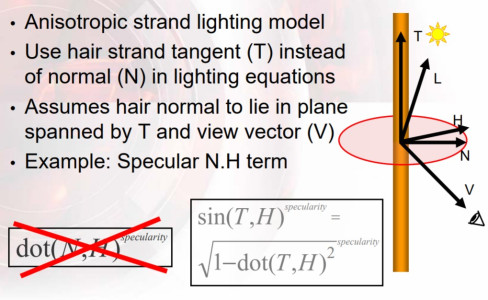
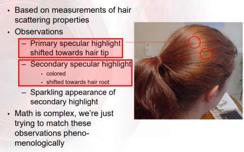
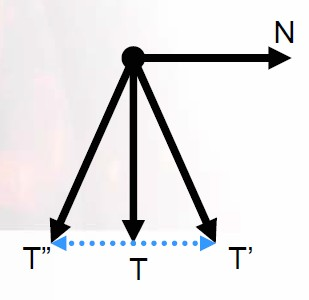
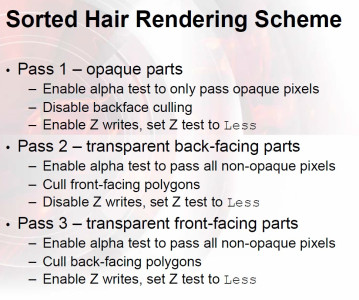

关键点：采用多边形建模，进行深度排序修正渲染顺序（因为半透问题），AO去模拟自阴影，两层高光，采用Tangent向量代替N进行高光计算；
<!--more-->

## 采用多边形建模

头发建模可分为发丝建模（关于发丝建模的渲染看[这里](https://developer.nvidia.com/gpugems/gpugems2/part-iii-high-quality-rendering/chapter-23-hair-animation-and-rendering-nalu-demo)）与多边形建模两种，当今游戏界所大量采用的做法也是多边形建模；

1. 多边形建模有更低的几何复杂性，以至于有更高的排序效率；相比之下采用发丝建模需要大约100K-150K的发丝来构建，复杂度高很多；
2. 采用多边形建模可以更加容易的集成到已有的渲染管线中去，基本已有的渲染管线都是处理的多边形模型；

## 高光计算

主要的高光计算都集成在下面这张PPT上；


<center>specular计算</center>

可以看出，kajiya计算模型与blin-phong模型比较类似，**本质上都是采用pow(NdotH, specularity)来进行的高光计算**；但是**kajiya模型没有使用多边形几何的法线来作为法线计算，而是采用法线平面的概念来作为法线的代替计算**；

> 虽然几何是多边形，但是仍然将其作为发丝来看待，Tangent向量作为发丝的方向；而发丝的法线应该位于与发丝垂直的平面上，且发丝与此平面的交点作为法线的起点；
>
> 图片中说法线位于T、V所决定的平面上，应该是错的；从公式中能够看出，应该是位于T、H所在的平面上才对；

法线平面即红色平面所显示的，法线平面中真正的法线，由T向量、H向量所决定的平面，与法线平面的交线来决定，我们将这里决定出来的法线用N1（区别于真正的多边形几何法线）来代替；由于T、H、N1都是单位向量，由几何关系可以得到**N1dotH = sin(T,H)**，到此，我们就可以使用T、H来进行高光计算了；

```c++
float StrandSpecular(float3 T, float3 V,
float3 L,float exponent)
{
    float3 H = normalize(L+ V);
    float dotTH= dot(T, H);
    float sinTH= sqrt(1.0 -dotTH*dotTH);
    float dirAtten= smoothstep(-1.0, 0.0, dot(T, H));
    return dirAtten* pow(sinTH, exponent);
}
```

## 模拟真正的头发高光

为了模拟头发真正的高光，还要基于对头发高光的观察进行部分假设，相应的观察假设在这张PPT上；


<center>hair参考</center>

1. 头发有两层高光；
2. 主高光切变流向朝向发梢；
3. 次高光拥有头发的颜色，且切变流向发根；
4. 次高光带有闪烁效果，即不是很连续；

模拟两层高光比较简单，只需要计算两次高光即可；

如何模拟高光的切变流向，即一个位置偏向发梢，一个偏向发根；因为我们使用模型的T来计算的高光，要想改变高光位置，只能从T下手；AMD提供的方法为，使用N（这里是多边形几何的法线，不是法线平面中的法线N1）对T进行偏移；偏移量可以从贴图中进行采样，计算公式如下：

```C++
float ShiftTangent(float3 T, float3 N, float shift)
{
    float3 shiftedT = T + shift * N;
    return normalize(shiftedT);
}
```

如下图：T'与T''是切变后的切向量；


<center>tangent计算</center>

T表示发丝的方向，那么当发丝方向发生变化时，N（多边形对应法线）自然而然也同样产生变化，偏移后的N为：

```C++
float3 B = cross(N, T);
N = cross(T, B);
```

> 实质上，N对T的偏移，是模拟头发的起伏，即发丝方向突出多边形平面或凹陷多边形平面；

次高光的闪烁效果模拟比较简单，只需要使用一个噪音纹理与次高光相乘即可；

总的代码为：

```c++
float4 HairLighting(float3 tangent,float3 normal,float3 lightVec, float3 viewVec, float2 uv, float ambOcc)
{ 
    // shift tangents
    float shiftTex = tex2D (tSpecShift, uv) – 0.5;
    float3 t1 = ShiftTangent(tangent, normal, primaryShift + shiftTex);
    float3 t2 = ShiftTangent(tangent, normal, secondaryShift + shiftTex);
    // diffuse lighting: the lerp shifts the shadow boundary for a softer look
    float3 diffuse = saturate (lerp (0.25, 1.0, dot(normal, lightVec));
    diffuse *= diffuseColor;
    // specular lighting
    float3 specular = specularColor1*StrandSpecular(t1, viewVec, lightVec, specExp1);
    // add 2nd specular term, modulated with noise texture
    float specMask= tex2D (tSpecMask, uv); // approximate sparkles using texture
    specular += specularColor2* specMask*StrandSpecular(t2, vieVec, lightVec, specExp2);
    // final color assembly
    float4 o;
    o.rgb = (diffuse + specular) * tex2D (tBase, uv) * lightColor;
    o.rgb *= ambOcc;             // modulate color by ambient occlusion term
    o.a = tex2D (tAlpha, uv);    // read alpha texture
    return o;
}
```

## 渲染排序问题

由于头发具有半透效果，必须依据一定的顺序进行渲染才能得到正确的Blend效果；

### 模型内部排序

由于模型是一簇一簇的，因为只要决定簇之间的排序即可；依据视线观看头发的顺序，可以依照发簇距离头皮的距离进行排序；让靠近头皮的发簇对应的Index buffer排在整个模型Index buffer的前面；这样模型内部的渲染顺序就完全正确了；

> 修改Index buffer的顺序，可以由模型制作时合并的顺序来决定；也可以由程序进行单独处理；

### 渲染时的pass设置

虽然使用模型内部排序就能解决发簇之间的渲染顺序问题，但是对于发簇内部的渲染顺序也需要控制，不然会会出现先绘制发簇前面，再绘制背面的问题；有时也会出现先看到靠近头皮的发簇，再看到远离头皮的发簇的情况，特别是针对女性的头发；

因此为了解决这些问题，需要引入多pass渲染来解决，如下图所示：


<center>pass设置</center>

Pass1：开启深度测试为Less并写入，开启alpha test，cull back；
Pass2：关闭深度写入，深度测试为Less，关闭alpha test，cull front；
Pass2：开启深度深度测试为Less并写入，关闭alpha test，cull back；

## 使用方案

1. 纹理需求：base tex（发色纹理，包含Scretched noise）、alpha tex（需包含全不透区域）、tangent shift tex（模拟头发起伏形状）、specular noise tex（用于第二层高光sparkling）
2. 模型需求：多边形建模，面片之间具有层次，且按照距表皮的距离进行排序合并；

## Reference

1. [Practical Real-Time Hair Rendering and Shading](https://developer.amd.com/wordpress/media/2012/10/Scheuermann_HairSketchSlides.pdf)
2. [Hair Rendering and Shading](http://web.engr.oregonstate.edu/~mjb/cs519/Projects/Papers/HairRendering.pdf)
