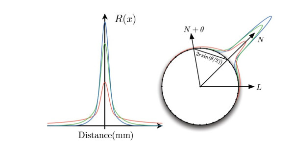
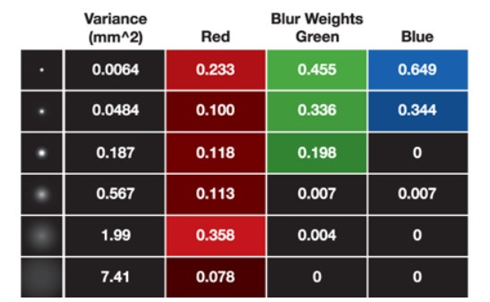
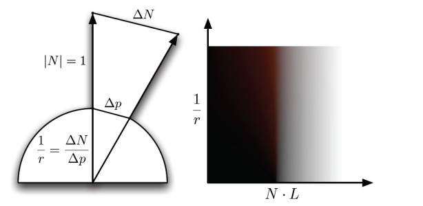
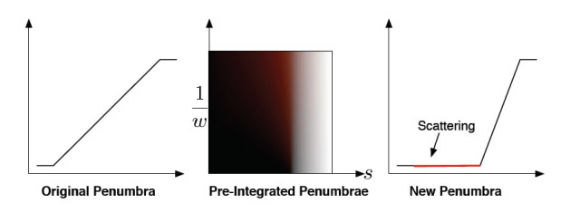
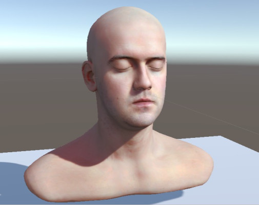
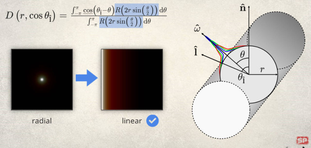

预积分皮肤散射主要解决三种皮肤散射情况[^1][^2]：

1. 表面弯曲引起的散射（Surface Curvature）；
2. 表面小凸起引起的散射（Small Surface Bumps）；
3. 投影边缘引起的散射（Shadows）；
<!--more-->

## Surface Curvature

单纯的wrap并不符合物理[^4]，需要通过diffusion profile积分才能获取正确的wrap；
预积分贴图是在球形假设下进行计算的，因此该方法最大的缺陷是模拟表面拓扑复杂的结构时，有很大不合理之处；
幸运的是，当今模型表面大都是平滑的，而不平滑的小的部分都用法线贴图进行假设计算；
积分方程为：

$$
D(\theta, r) = \frac{\int_{-\pi/2}^{\pi/2} {cos(\theta+x)*R(2rsin(x/2))} \,{\rm d}x}{\int_{-\pi/2}^{\pi/2} {R(2rsin(x/2))} \,{\rm d}x}
$$

式中R(d)表示Diffusion profile，表示相应距离下的辐射度，d表示距离。该式表示在曲率半径为r的半球下，对应$\theta$角度下，其它所有角度在该角度下的散射强度；对应模型如下图所示：


<center>Integrated model</center>

**图中的$\theta$应该全部用x来表示！**从图中的右侧的模型能够看出，N为我们要求的散射角度，L与N之间的角度为$\theta$，L在$N+x$处的光照强度为$cos(\theta+x)$；N距N+x的距离为2rsin(x/2)，即弦长；N+x在N处的散射可由R(d)计算得出；

图中的Diffusion profile一般使用高斯核叠加进行表示，对于rgb各成分的高斯核表示为：


<center>gaussian拟合</center>

最终得到一个Diffusion profile在不同$\theta$角度和曲率半径下的积分分布；将$\theta$角度和曲率半径转换为NdoL和1/r，即可得到常用的预积分贴图；如下图所示：


<center>预积分贴图</center>

其中曲率的求法可在shader中借助偏导函数计算，即：

```C++
float3 dn = fwidth(N);
float3 dp = fwidth(P);

float c = length(dn)/length(dp);
```

不过，更好的做法是把曲率进行预计算，然后将计算结果存储到顶点色或者贴图里，因为在shader中计算得来的曲率很容易产生不连续及其他瑕疵问题；

Simon对得到的积分贴图进行了公式拟合[^3]，不过拟合公式的计算量仍然比较大，是否能得到性能上的优化，需要进行进一步测试;

## Small Surface Bumps

对于小的凸起以及皱纹，不能使用预积分来进行计算，但是由于可以多采样，因此可以使用预滤波的方式处理法线贴图；

对于specular使用正常的normalmap，对于diffuse的rgb分别使用针对不同Diffusion profile处理后的normalmap，因此需要4张normalmap；

为了效率考虑，可以使用一种高精度无滤波的normalmap，一张低精度预滤波的normalmap，针对rgb使用不同参数调制两者之间的插值来近似diffusion profile处理的结果；

可以将低精度预滤波的normalmap省略，使用高精度normalmap的低mip来作为低精度预滤波的结果，更近一步可以直接使用模型法线来代替；具体的选择需要在效果与性能之间权衡；

由于针对rgb调制过后的法线有三个，因此要采样三次前面的preintegrated map；针对不同的性能要求，可以选择性的省略这一环节；

## Shadows Scattering

皮肤出的散射特性在投影边缘会体现出来，具体模拟此现象是很困难的一件事情，但是我们可以通过一些trick来实现；

首先，阴影强度为0或1，表示被遮挡，或不被遮挡；位于两者之间的值，及表示半影区域，及发生散射的区域（前提是使用软阴影）；因此我们可以针对这一点，利用Diffusion profile进行积分，来得到阴影值与散射强度的关系；

积分的过程是针对位置进行积分，需要将阴影值映射到位置上后才能积分，针对不同的软阴影方法，映射函数是不同的；我们用P()表示阴影值与到blur kernel距离的函数，则此映射为$p^-{1}()$；具体的积分方程为：
$$
P_S(s,w)  = \frac{\int_{-\infty}^{\infty} {P^\prime(P^{-1}(s)+x)R(x/w)} \,{\rm d}x}{\int_{-\infty}^{\infty} {R(x/w)} \,{\rm d}x}
$$
针对box blur软阴影（PCF）方法，其过程如下：


<center>投影预积分</center>

需要注意的是，半影区域的一部分（宽度到没提及）作为正常的软阴影计算插值，剩下的一部分作为这些软阴影散射产生的影响；P'()即表示新的半影函数分布；

最终得到一张投影的预积分图；其散射强度为阴影值s、以及半影宽度w（世界空间）的函数；

最终的渲染结果为：


<center>预积分渲染结果</center>

## extended preintegrated subsurface scattering

在原文中，作者在展望中写到，未来会将预积分应用于环境光，以及考虑多个主轴区域对结果的影响；然后在游戏**Ghost of Tsushima**中就实装了这些展望[^5];

扩展最重要的假设，就是不再认为预积分贴图的计算是在球面积分得到的，而是在柱面上；此时计算预积分贴图使用不再是前面的redial diffusion profile，而应该linear diffusion profile（通过对redial积分获得）；此时使用的曲率也不再是平均曲率，而是方向曲率；


<center>柱状模型</center>

> 需要注意的是，对于环境光的预积分计算仍需要使用球面假设；因为原文积分使用的zonal harmonics，只能使用redial diffusion profile；

不同光照方向下的方向曲率可以通过曲率向量变换来计算，如下所示：

$$
K_I = I^T·II·I
$$

其中`$K_I$`表示在方向`$I$`上的曲率，`$II$`即为我们要求的2x2的曲率张量；在主方向上的曲率张量会变为为2x2的对角矩阵，为：

$$
K_I = [d_1,d_2]·\begin{bmatrix}
k_1 & 0   \\\\
0   & k_2 \\\\
\end{bmatrix}·[d_1,d_2]^T
$$

其中`$[d_1,d_2]$`即为主方向坐标系的方向向量，`$k_1、k_2$`为主方向下的方向曲率；

> 关于曲率张量的计算方法，详细细节需要参考论文[^6]；更详细细节可以参考后面所提出来的开源代码；

由于曲率张量为轴对称的，因此只需要记录三个参数，加上用来计算环境光需要的平均曲率，四个参数刚好可以存储到顶点的一个4byte属性中；

方向曲率的转换代码如下：

```c++
float CurvatureFromLight(    float3 tangent,    float3 bitangent,    float3 curvTensor,    float3 lightDir)
{   
    // Project light vector into tangent plane    
    float2 lightDirProj = float2(dot(lightDir, tangent), dot(lightDir, bitangent));  
    
    // NOTE (jasminp) We should normalize lightDirProj here in order to correctly  
    // calculate curvature in the light direction projected to the tangent plane.    
    // However, it makes no perceptible difference, since the skin LUT does not vary  
    // much with curvature when N.L is large.   
    
    float curvature = curvTensor.x * GSquare(lightDirProj.x) +     
    2.0f * curvTensor.y * lightDirProj.x * lightDirProj.y +
    curvTensor.z * GSquare(lightDirProj.y);
    
    return curvature;
}
```

## Code Appendix

### Lookup Textures

```c++
float Gaussian (float v, float r)
{
    return 1.0/sqrt(2.0*UNITY_PI*v)*exp(-(r*r)/(2*v));
}

float3 Scatter(float r)
{
    return Gaussian(0.0064*1.414, r)*float3(0.233,0.455,0.649)+
    Gaussian(0.0484*1.414, r)*float3(0.100,0.336,0.344)+
    Gaussian(0.1870*1.414, r)*float3(0.118,0.198,0.000)+
    Gaussian(0.5670*1.414, r)*float3(0.113,0.007,0.007)+
    Gaussian(1.9900*1.414, r)*float3(0.358,0.004,0.000)+
    Gaussian(7.4100*1.414, r)*float3(0.078,0.000,0.000);
}

float3 integrateDiffuseScatteringOnRing(float cosTheta , float skinRadius)
{
    // Angle from lighting direction.
    float theta = acos(cosTheta);
    float3 totalWeights = 0;
    float3 totalLight = 0;
    float a= -UNITY_PI/2;
    float inc = 0.001;

    while(a <= UNITY_PI/2)
    {
        float sampleAngle = theta + a;
        float diffuse= saturate(cos(sampleAngle));
        float sampleDist = abs(2.0*skinRadius*sin(a*0.5));
        // Distance.
        float3 weights = Scatter(sampleDist);
        // Profile Weight.
        totalWeights += weights;
        totalLight += diffuse*weights;
        a+=inc;
    }
    return totalLight/totalWeights;
}

float newPenumbra(float pos)
{
    return saturate(pos*2-1);
}

//penumbraLocation为归一化后的在半影区域内的位置；
float3 integrateShadowScattering(float penumbraLocation, float penumbraWidth)
{
    float3 totalWeights = 0;
    float3 totalLight = 0;
    float PROFILE_WIDTH = UNITY_PI*4;   //应该为测量数据，没找到资料，这里取个差不多的数值，在保证运行效率下尽量大
    float inc = 0.001;

    float a = -PROFILE_WIDTH;
    while(a <= PROFILE_WIDTH)
    {
        float light = newPenumbra(penumbraLocation+a/penumbraWidth);
        float sampleDist = abs(a);
        float3 weights = Scatter(sampleDist);
        totalWeights += weights;
        totalLight += light*weights;
        a+=inc;
    }

    return totalLight/totalWeights;
}
```

### Simplified Skin Shader

```c++
//wrapndl:0-1
//curvature:曲率
//http://simonstechblog.blogspot.com/2015/02/pre-integrated-skin-shading.html
float3 SimonInterpolate(float3 wrapndl, float curvature)
{
    float3 NdotL = wrapndl;
    float curva = (1.0/mad(curvature, 0.5 - 0.0625, 0.0625) - 2.0) / (16.0 - 2.0); // curvature is within [0, 1] remap to normalized r from 2 to 16
    float oneMinusCurva = 1.0 - curva;
    float3 curve0;
    {
        float3 rangeMin = float3(0.0, 0.3, 0.3);
        float3 rangeMax = float3(1.0, 0.7, 0.7);
        float3 offset = float3(0.0, 0.06, 0.06);
        float3 t = saturate( mad(NdotL, 1.0 / (rangeMax - rangeMin), (offset + rangeMin) / (rangeMin - rangeMax)  ) );
        float3 lowerLine = (t * t) * float3(0.65, 0.5, 0.9);
        lowerLine.r += 0.045;
        lowerLine.b *= t.b;
        float3 m = float3(1.75, 2.0, 1.97);
        float3 upperLine = mad(NdotL, m, float3(0.99, 0.99, 0.99) -m );
        upperLine = saturate(upperLine);
        float3 lerpMin = float3(0.0, 0.35, 0.35);
        float3 lerpMax = float3(1.0, 0.7 , 0.6 );
        float3 lerpT = saturate( mad(NdotL, 1.0/(lerpMax-lerpMin), lerpMin/ (lerpMin - lerpMax) ));
        curve0 = lerp(lowerLine, upperLine, lerpT * lerpT);
    }
    float3 curve1;
    {
        float3 m = float3(1.95, 2.0, 2.0);
        float3 upperLine = mad( NdotL, m, float3(0.99, 0.99, 1.0) - m);
        curve1 = saturate(upperLine);
    }
    float oneMinusCurva2 = oneMinusCurva * oneMinusCurva;
    float3 brdf = lerp(curve0, curve1, mad(oneMinusCurva2, -1.0 * oneMinusCurva2, 1.0) );
    return brdf;
}

float3 SkinDiffuse(float3 ndl, float curvature)
{
    float3 lookup = ndl*0.5+0.5;
    float3 diffuse;
    diffuse.r = tex2D(_PreIntegratedSkinTex, float2(lookup.r, curvature)).r;
    diffuse.g = tex2D(_PreIntegratedSkinTex, float2(lookup.g, curvature)).g;
    diffuse.b = tex2D(_PreIntegratedSkinTex, float2(lookup.b, curvature)).b;
    return diffuse;
}

float3 SkinShadow(float atten, float width)
{
    return tex2D(_PreIntegratedShadowTex, float2(atten, width)).rgb;
}

// Simple curvature calculation.
float dn = length(fwidth(oldN));
float dp = length(fwidth(i.worldPos));
float curvature = saturate(dn/dp*_TuneCurvature);

// Specular / Diffuse Normals.
float4 normMapHigh = tex2D(NormalSamplerHigh, Uv)*2.0 - 1.0;
float4 normMapLow = tex2D(NormalSamplerLow, Uv)*2.0 - 1.0;
float3 Nhigh = mul(normMapHigh.xyz, TangentToWorld);
float3 Nlow = mul(normMapLow.xyz, TangentToWorld );
float3 rS = Nhigh ;
float3 rN = lerp(Nhigh, Nlow, tuneNormalBlur.r);
float3 gN = lerp(Nhigh, Nlow, tuneNormalBlur.g);
float3 bN = lerp(Nhigh, Nlow, tuneNormalBlur.b);

// Diffuselighting
float3 NdotL = float3(dot(rN,L), dot(gN,L), dot(bN,L));
float3 diffuse = SkinDiffuse(curvature, NdotL) * LightColor * SkinShadow(atten, _TunePenumbraWidth);
```

### Calculate Directional Curvature

代码量偏大，详细细节可参考论文作者的开源库[origin trimesh2](https://gfx.cs.princeton.edu/proj/trimesh2/)以及[github trimesh2](https://github.com/Forceflow/trimesh2);

## Reference

[^1]: [Penner pre-integrated skin rendering (siggraph 2011 advances in real-time rendering course)](https://www.slideshare.net/leegoonz/penner-preintegrated-skin-rendering-siggraph-2011-advances-in-realtime-rendering-course)
[^2]: GPU Pro 2, Part 2. Rendering, Chapter 1. Pre-Intergrated Skin Shading
[^3]: [Simon's Tech Blog](http://simonstechblog.blogspot.com/2015/02/pre-integrated-skin-shading.html)
[^4]: [GPU Gems 1, Real-Time Approximations to Subsurface Scattering](https://developer.nvidia.com/gpugems/gpugems/part-iii-materials/chapter-16-real-time-approximations-subsurface-scattering)
[^5]: [Ghost of Tsushima](https://blog.selfshadow.com/publications/s2020-shading-course/patry/slides/index.html)
[^6]: [Estimating Curvatures and Their Derivatives on Triangle Meshes](https://geometry.stanford.edu/papers/ng-test1/ng-test1.pdf)
