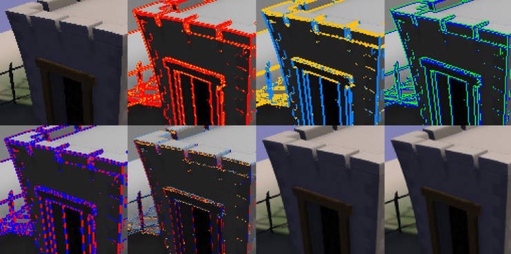

FXAA是非常方便且高效的抗拒齿方法，本文主要依据FXAA白皮书进行理论介绍[^1]，然后针对一些实现方法进行探讨[^2]；
<!--more-->

## FXAA特点

1. 可减弱明显的锯齿，同时保持画面锐利的部分；最重要的是，具有很好的实时性；
2. 可用于几何抗拒齿也可用于shading抗拒齿，具有处理single-pixel与sub-pixel锯齿的逻辑；
3. 使用一个pass即可实现FXAA，非常易于集成；与MSAA相比能节省大量内存；
4. 对于延迟渲染来说，相比MSAA与SSAA，可以提供优秀的性能；

> 这里的single-pixel锯齿指single pixel lines问题；
> sub-pixel锯齿中的sub-pixel也不是指真正意义上的sub-pixel，而是指AA中的firefly问题，以及渲染中常用一些jitter所带来的问题；

## FXAA官方样例

官方Demo需要到NVIDIA官网进行下载，在[这里](https://developer.nvidia.com/gameworksdownload)选择GAMEWORKS->Graphics Library->D3D Graphics and Compute Samples进行下载[^3]；

Demo中预制了不同的preset，用户可以从中获取性能与质量之间的权衡；

## 集成相关

### Preset Selection

- preset0提供了最好的性能同时也提供了最差的质量；它仅仅提供了边缘的抗拒齿，与最低质量的sub-pixel aliasing；此preset不是针对于应用，而主要用来展示一些可控制的参数的最低限制；
- Preset1延伸了边缘末端搜索的半径，并添加了更改质量的sub-pixel aliasing，增加了受影响的局部对比范围；此preset主要用于性能非常受限的设备，比如一些高分辨率的GPU设备；
- Preset2是一个很好的默认设置对于高性能要求的设备，但是仍然有些瑕疵在边缘的末尾；此preset减少了搜索的加速步长，增加了搜索半径，增大了局部受影响的范围；
- Preset3提供很高的质量，同时没有瑕疵，边缘末尾搜索加速关闭；
- Preset4或者更高的preset单纯增加了边缘末端搜索的半径，更好的质量意味着付出更多的性能代价，这些preset主要用来展示可控制参数的上限；

### Single Full Screen Pass

FXAA的运行只需要一个全屏三角形的pixel shader，即一个后期pass，因此可以非常容易的通过一个shader shell来进行集成，主要计算内容放在include文件中；

需要注意的是preset0到preset2需要各项异性采样（最大sample设为4）来采样输入，这里的各项异性，是在硬件加速计算多个像素对的平均值时使用的；

### Alias sRGB as UNORM

AA的应用会涉及到所在的[颜色空间](2021-06-26-light-and-color-gamma/index.md)，FXAA建议使用在tonemapping之后的LDR sRGB空间；

将FXAA应用到HDR空间，很容易产生跟tonemapping前使用MSAA一样的瑕疵；

FXAA需要非线性的rgb颜色空间（眼睛感知的空间）作为输入以及filter，因为FXAA中查找边缘端部的操作需要进行插值的采样，因此使用眼睛感知的空间进行插值代替线性空间的插值非常重要；

> 个人不是很同意在感知空间进行采样的观点，因为按照RTR4中颜色空间的介绍，这样会产生ropping问题；

### Apply FXAA Prior to HUD/UI

这个对于所有后期来说，基本都是这样，很少有在HUD/UI上使用后期的需求；

### Optimized Integration

如果对性能要求极高，可以考虑将FXAA集成到Uber pass中，即：FXAA + composite bloom results + color grading + adding film noise；

如果引擎提供了选择应用后期的区域的能力，即能得到应用后期的mask；那么对于DOF与motion blur的模糊区域，可以不需要进行FXAA的计算；

## 算法实现

### Algorithm Overview

1. FXAA采样non-linear rgb颜色，并将其转换为标量的亮度，用于后面的shader逻辑；
2. FXAA检查local contrast来避免处理non-edges区域（边缘检测）；检测到的边缘绘制成红色，混合至黄色来表示sub-pixel aliasing的程度；
3. local contrast同时被用来计算edge的方向，金色为横向，蓝色为纵向；
4. 给定边缘方向，选择与边缘成 90 度的对比度最高的像素对，用蓝色与绿色表示该像素对位于边缘的哪一侧（**用来精确定位edge位于那两个像素之间**）；
5. 该算法在沿边缘的负方向和正方向（红色/蓝色方向）上搜索边缘末端。检查沿边缘的高对比度像素对的平均亮度是否有显着变化；
6. 给定边缘的末端，将边缘上的像素位置转换为垂直于边缘 90 度的子像素偏移，以减少锯齿；红色/蓝色表示水平方向上正负偏移，金色/蓝色表示垂直方向上的正负转移；
7. 使用偏移后坐标重新采样贴图；
8. 最后使用低通滤波来处理sub-pixel aliasing，根据sub-pixel aliasing的程度进行blend；


<center>fxaa algorithm</center>

### Luminance Conversion

Nvidia建议使用red以及green通道来计算亮度进行优化，人眼对这两种颜色最为敏感；亮度计算方法如下：

```c++
float FxaaLuma(float3 rgb) {return rgb.y * (0.587/0.299) + rgb.x; }
```

### Local Contrast Check

local contrasts的计算都会使用当前像素以及及上下左右四个像素，来计算最大值与最小值的差值；当对比度大于某个最大值的阈值比例时，认为当前点处于边缘位置，会进行后续运算；该阈值比例会clamp到一个最小值，用于避免在暗部区域进行AA的计算；

```c++
float3 rgbN  = FxaaTextureOffset(tex, pos.xy, FxaaInt2( 0,-1)).xyz;
float3 rgbW  = FxaaTextureOffset(tex, pos.xy, FxaaInt2(-1, 0)).xyz;
float3 rgbM  = FxaaTextureOffset(tex, pos.xy, FxaaInt2( 0, 0)).xyz;
float3 rgbE  = FxaaTextureOffset(tex, pos.xy, FxaaInt2( 1, 0)).xyz;
float3 rgbS  = FxaaTextureOffset(tex, pos.xy, FxaaInt2( 0, 1)).xyz;
float lumaN  = FxaaLuma(rgbN);
float lumaW  = FxaaLuma(rgbW);
float lumaM  = FxaaLuma(rgbM);
float lumaE  = FxaaLuma(rgbE);
float lumaS  = FxaaLuma(rgbS);
float rangeMin = min(lumaM, min(min(lumaN, lumaW), min(lumaS, lumaE)));
float rangeMax = max(lumaM, max(max(lumaN, lumaW), max(lumaS, lumaE)));
float range = rangeMax -rangeMin;
if(range < max(FXAA_EDGE_THRESHOLD_MIN, rangeMax * FXAA_EDGE_THRESHOLD))           {return FxaaFilterReturn(rgbM); }
```

#### Tuning Defines

FXAA_EDGE_THRESHOLD：处理local contrast的阈值比例

- 1/3 – too little；
- 1/4 – low quality；
- 1/8 – high quality；
- 1/16 – overkill；

FXAA_EDGE_THRESHOLD_MIN：处理暗部区域的阈值；

- 1/32 – visible limit；
- 1/16 – high quality；
- 1/12 – upper limit (start of visible unfiltered edges);

### Sub-pixel Aliasing Test

之前检测的最大值与最小值的差，称之为local contrast。pixel contrast使用当前pixel的luma与luma的均值（上下左右的平均值）的差来定义；pixel contrast与local contrast的比值可以用来计算sub-pixel aliasing；该值越接近于1，越表示single pixel dots的存在，越接近于0，表示对边缘的贡献越大；这个比值可以转换为最后低通滤波blend的程度；

```c++
float lumaL = (lumaN + lumaW + lumaE + lumaS) * 0.25;
float rangeL = abs(lumaL - lumaM);
float blendL = max(0.0, (rangeL / range) - FXAA_SUBPIX_TRIM) * FXAA_SUBPIX_TRIM_SCALE;
blendL = min(FXAA_SUBPIX_CAP, blendL); 
```

低通滤波的值使用3x3的box filter来进行计算；

```c++
float3 rgbL = rgbN + rgbW + rgbM + rgbE + rgbS; // ... 
float3 rgbNW = FxaaTextureOffset(tex, pos.xy, FxaaInt2(-1,-1)).xyz;
float3 rgbNE = FxaaTextureOffset(tex, pos.xy, FxaaInt2( 1,-1)).xyz;
float3 rgbSW = FxaaTextureOffset(tex, pos.xy, FxaaInt2(-1, 1)).xyz;
float3 rgbSE = FxaaTextureOffset(tex, pos.xy, FxaaInt2( 1, 1)).xyz;
rgbL += (rgbNW + rgbNE + rgbSW + rgbSE);
rgbL *= FxaaToFloat3(1.0/9.0);
```

#### Tuning Defines

FXAA_SUBPIX：控制subpix filtering的开启；

- 0 – turn off；
- 1 – turn on；
- 2 – turn on force full (ignore FXAA_SUBPIX_TRIM and CAP)

FXAA_SUBPIX_TRIM：控制sub-pixel aliasing的移除程度；

- 1/2 – low removal；
- 1/3 – medium removal；
- 1/4 – default removal；
- 1/8 – high removal；
- 0 – complete removal；

FXAA_SUBPIX_CAP：确保细节不会被完全抹除；

- 3/4 – default amount of filtering；
- 7/8 – high amount of filtering；
- 1 – no capping of filtering；

### Vertical/Horizontal Edge Test

边缘检测的滤波器比如sobel不能用来检测single pixel lines，此类滤波器在pixel center会检测失效；因此FXAA将局部 3x3 邻域的行和列的高通值的加权平均幅度来评判local edge，从而得到edge的方向。

```c++
float edgeVert = 
    abs((0.25 * lumaNW) + (-0.5 * lumaN) + (0.25 * lumaNE)) + 
    abs((0.50 * lumaW ) + (-1.0 * lumaM) + (0.50 * lumaE )) + 
    abs((0.25 * lumaSW) + (-0.5 * lumaS) + (0.25 * lumaSE));
float edgeHorz = 
    abs((0.25 * lumaNW) + (-0.5 * lumaW) + (0.25 * lumaSW)) + 
    abs((0.50 * lumaN ) + (-1.0 * lumaM) + (0.50 * lumaS )) + 
    abs((0.25 * lumaNE) + (-0.5 * lumaE) + (0.25 * lumaSE));
bool horzSpan = edgeHorz >= edgeVert; 
```

### End-of-edge Search

给定了edge的方向后，FXAA首先计算出与edge90度垂直的具有最高对比的的像素对；然后沿着edge的正负方向查找，直到达到查找限制或像素对的平均值的变化量到达某个程度；

一个简单的循环查找可以在正方向与负方向以并行的方式进行，这样可以降低shader中brunch语句的使用；

当查找加速被开启时（即preset0，1，2），查找可以使用硬件aniostropic filtering作为box filter来检测多个像素对，得到加速的效果；

```c++
for(uint i = 0; i < FXAA_SEARCH_STEPS; i++)
{   
    #if FXAA_SEARCH_ACCELERATION == 1     
        if(!doneN) lumaEndN = FxaaLuma(FxaaTexture(tex, posN.xy).xyz);
        if(!doneP) lumaEndP = FxaaLuma(FxaaTexture(tex, posP.xy).xyz);   
    #else 
        if(!doneN) lumaEndN = FxaaLuma(             FxaaTextureGrad(tex, posN.xy, offNP).xyz);
        if(!doneP) lumaEndP = FxaaLuma(             FxaaTextureGrad(tex, posP.xy, offNP).xyz);     
    #endif
    doneN = doneN || (abs(lumaEndN - lumaN) >= gradientN);
    doneP = doneP || (abs(lumaEndP - lumaN) >= gradientN);
    if(doneN && doneP) break;
    if(!doneN) posN -= offNP;
    if(!doneP) posP += offNP;
}
```

#### Tuning Defines

FXAA_SEARCH_STEPS：控制最大查找步数；

FXAA_SEARCH_ACCELERATION：控制使用anisotropic filtering加速的程度；

- 1 – no acceleration；
- 2 – skip by 2 pixels；
- 3 – skip by 3 pixels；
- 4 – skip by 4 pixels (hard upper limit)；

FXAA_SEARCH_THRESHOLD：控制何时停止查找；

- 1/4 – seems best quality wise；

## Unity中FXAA

Unity提供了两种形式的FXAA[^4]：

### Post process FXAA

一种是PostProcess插件中的FXAA，其实现方式与NVIDIA公开的方法基本一致，直接引用了NVIDIA公开的fxaa头文件；

### URP FXAA

一种是URP里面内置的FXAA，具体实现可以查看[源码](https://github.com/Unity-Technologies/Graphics/blob/master/com.unity.render-pipelines.universal/Shaders/PostProcessing/Common.hlsl)；能大概看出来，此FXAA移除了sub-pixel aliasing，将整个AA过程分割为两个部分，一个是dir方向的计算，一个是沿dir方向的blur，从而达到AA的效果；

其中dir的计算通过**左上左下右上右下**四个像素的差值来计算；blur的程度按照正常流程需要计算edge的长度来控制，URP直接沿dir方向进行四个采样，采样步长由dir控制；然后根据四个采样与中心采样的亮度比较，来决定最后使用什么程度的blur值；

URP的FXAA可以说是NVIDIA FXAA的简化形式，非常适用于对性能要求极高的平台；实际上URP中的FXAA还可以加上NVIDIA提供FXAA里面的阈值检测机制，从而提前退出不必要的AA计算，得到究极高效版FXAA；

## references

[^1]: [FXAA_WhitePaper](https://developer.download.nvidia.cn/assets/gamedev/files/sdk/11/FXAA_WhitePaper.pdf);
[^2]: [implementing_fxaa](http://blog.simonrodriguez.fr/articles/30-07-2016_implementing_fxaa.html);
[^3]: [NVIDIA Download Center](https://developer.nvidia.com/gameworksdownload);
[^4]: [Graphics](https://github.com/Unity-Technologies/Graphics);
