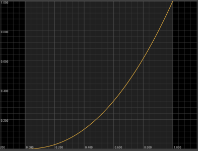
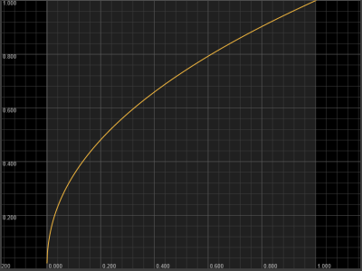
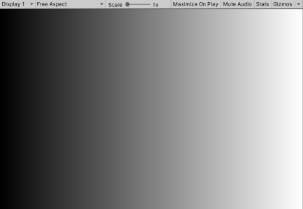
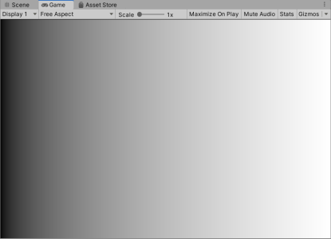
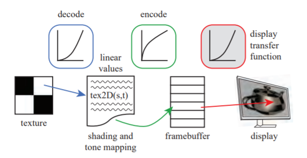
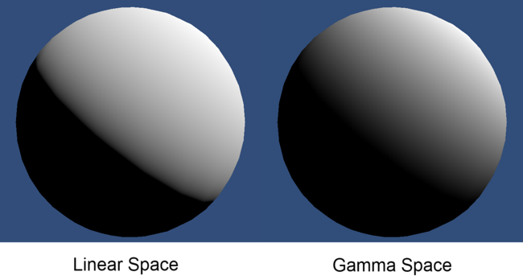
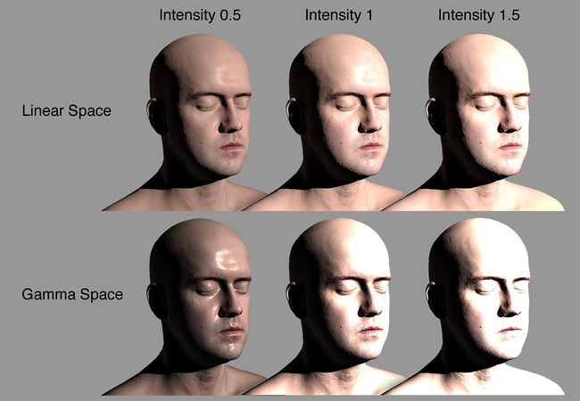
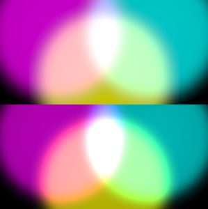
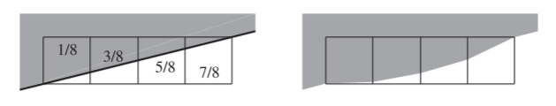

在图形开发中，总绕不开的一个名词，gamma，这里会对gamma进行一个粗暴但是通俗的讲解，便于理清图形开发中关于gamma的一切；
<!--more-->

## 一、gamma是什么？

gamma是什么，gamma faq[^1]中有解释：在传统的crt显示器中，屏幕显示的luminance与电压并不是成正比的关系，而是成一个幂次方的关系，即`$l = v^\gamma$`，其中的幂就是我们通说所说的gamma；

显示器的gamma变换

## 二、gamma correction

### gamma correction是什么？

由于显示器所显示的luminance为正常展示场景亮度的gamma次方（我们称之为gamma变换），为了使显示器亮度为正常的展示场景亮度，抵消显示器gamma变换的影响，必须在显示器前对展示场景亮度做 **gamma变换的逆变换** ，此逆变换我们称之为 **gamma correction** ；

显示器的gamma correction

实际上场景所在的空间，我们常称之为线性空间，即 **linear space** ，对应着曲线y=x；经过 **gamma correction过后的空间** ，我们称之为gamma空间，即 **gamma space** ，对应着曲线y=x的上半段；

gamma correction有时也称 **encode gamma** ，从gamma空间转换到线性空间变换则称之为 **decode gamma** ；

### 为什么需要gamma correction？

上面已经说到，做gamma correction是为了让显示器显示正常的场景亮度，这就是要做gamma correction的做主要的原因；

实际上人眼看到现实场景就是线性的，要想让观众觉得显示器里的东西更接近现实，显示器就必须要显示为线性空间；

### 关于gamma的巧合

实际上， **人眼对亮度的感知也并不是线性的，巧合的是，人眼对亮度的感知曲线搞刚好是显示器gamma变换的逆变换的曲线（与gamma矫正类似）**[^2]；

这样导致的结果就是：假如没有gamma correction，显示器显示一段均匀变化的亮度，人眼感知到的亮度刚好也是均匀的；因为显示器先做了gamma变换，人眼感知又做了gamma逆变换，导致人眼感知到的是均匀的；如下图所示：

未做gamma correction的0-1渐变图

如果我们做了gamma correction，这个时候虽然是显示器最终显示的是均匀变化的亮度，但是人眼的感受却是不均匀的；因为先做了gamma correction（gamma逆变换），然后显示器做了gamma变换，人眼感知又做了gamma逆变换，导致人眼感知到的是gamma逆变换后的；如下图所示：

做了gamma correction的0-1渐变图

做了gamma correction之后的渐变图就是人眼真正应该感知到的渐变图：暗部人眼感知到的亮度大于实际亮度，且相差比较大；亮部人眼感知到的亮度与实际亮度基本持平，且相差较小；

之所以人眼有这样的特征，是因为为了能够在夜晚中生存，暗部或被人眼感知上提亮，这样就能够避免夜晚中不可知的危险；

## 三、实际使用的gamma

### 文件保存中的gamma

实时上， **我们在电脑屏幕上看到的大部分图片都是处于gamma空间的** ，尤其是屏幕的截图，屏幕的吸色，得到的都是gamma空间的颜色，他们经常存储在png、tga、jpg等格式的文件；在显示这些图片时， **他们直接会被送到屏幕缓冲中进行显示** ；由于文件本身为gamma空间，图片颜色经过显示器的gamma变换，就会显示为线性空间下的颜色，再进入人眼中，被我们人眼感知；

### 渲染管线中的gamma

在图形渲染中，有各种各样的环节，包括pbr shading、后期color grading、后期tone mapping、aa等等；同一个环节内也可能包含各种各样的模块与环节，比如pbr shading环节就包括贴图读取、brdf相关矢量计算、brdf计算等（不管这些是在vs阶段、还是ps阶段）；
在这些环节中大部分的计算会与颜色相关，说到颜色也就伴随着gamma空间与线性空间；那么在整个渲染管线中，应给如何处理gamma问题呢？
关于gamma的处理，首先确认的是，显示器显示的空间应该是线性空间（前面的为什么需要gamma correction已经提到），所以输送到屏幕缓冲的颜色应该为gamma空间，为了抵消屏幕的影响；另外要注意的是，我们关于颜色的光照计算或者其他计算应该在线性空间（除非一些必须在gamma空间或其他空间的计算），以为线性空间的颜色才是物体本身的颜色，在线性空间下进行光照或其他计算才是物理正确的，否则都是物理不正确的；
所以 **整体的流程** 应该是：

1. 读取贴图颜色，位于[gamma space](#文件保存中的gamma)；
2. decode gamma到linear space，然后进行光照或其他关于颜色的计算；
3. encode gamma到gamma space（gamma correction），然后写入到屏幕缓存；
4. 显示器进行gamma变换，显示为linear space下的颜色；

下图为rtr中在现实过程中gamma的处理[^3]，与我们之前所理解的一致；

gamma process in display

### gamma使用不当会引起的问题

事实上，早期人们还没有意识到gamma的问题，以至于很多图形上的操作都是在gamma空间下进行的，以至于出现了很多画面上的问题，包括light fall-off、linear intensity response、linear and gamma blending等[^4]；分别如下图所示：

light fall-off

light fall-off影响的为光照沿平面朝向的衰减，其实是就是计算该点的irridience，在diffuse上会有明显的感受；可以看到gamma space下亮度分布更均匀，linear space下亮度分布更接近[人眼感知](#关于gamma的巧合)；

linear intensity response

gamma空间下，不同光强产生的影响会更加反直觉，会非常容易产生过曝的问题，以至于在项目中美术打光很难控制光照强度；

linear and gamma blending

gamma空间下的blend则会引起色相偏移问题（插值、叠加或其他blend方式），这在工程中对美术来说是很不友好的，特别是游戏中的特效，受此影响最为过大；在rtr4中则还提到了叠加引起的亮度感知错误问题，在5.6章节，有兴趣的可以看一下；

ropping

ropping现象则是因为没有经过gamma correction引起的直线弯曲效应；不过需要在使用msaa或者ssaa的情况下才能看到，上图就是开8xaa情况下出现的问题；

## gamma所带来的的优势

1. CRT所使用的的非线性变换，刚好为人眼感知的逆向；这使得CRT的响应在人眼的视觉感知上为线性的；这种特性是高度需要的；
2. Gamma correction的使用不仅是为了补偿CRT自身所带来的非线性变换，更重要的是，人眼对暗部区域的感知比亮部更加敏感，使用gamma空间来进行文件存储，可以大量减少存储所实际需要的精度；

## 总结

本文主要介绍了图形学中gamma的由来，以及图形开发中与gamma相关的场景；开发者们需要注意gamma的存在，并通过正确的线性工作流来避免gamma引起显示不正确问题；

## references

[^1]: [gamma faq](http://poynton.ca/notes/colour_and_gamma/GammaFAQ.html)
[^2]: [what are color spaces, color profiles and gamma correction?](https://www.wigglepixel.nl/en/blog/what-are-color-spaces-color-profiles-and-gamma-correction)
[^3]: [realtimerendering](http://www.realtimerendering.com/)
[^4]: [linear or gamma workflow](https://docs.unity3d.com/manual/linearrendering-linearorgammaworkflow.html#:~:text=linear%20or%20gamma%20workflow%20the%20unity%20editor%20offers,of%20a%20mesh%20to%20give%20it%20visual%20detail.)
