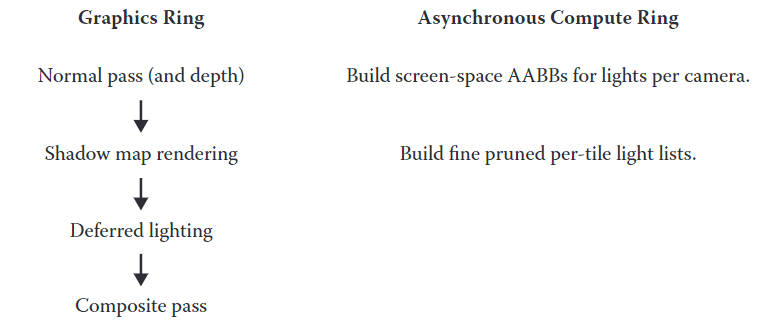

Fptl是基于tiled base lighting而开发出来的更高效的光照计算方法，相比于tbl的光源剔除粒度（tiled级别下的剔除），Fptl可以达到逐像素级别的剔除，从而使光照计算更加高效。
<!--more-->

## 概述

Fptl已经应用在**Rise of the Tomb Raider**游戏中，Unity的hdrp中也使用了这一技术；在实际过程中，light list的生成会在渲染shadow map时，借助computer shader进行异步计算；

light list的生成会分为两步：

- 第一步生成初步的light list，此时light list的生成，由tile对应的screen space bounding volume与光源对应的aabb进行求交计算得来，计算结果存储在local storage中；
- 第二步进行精细剔除，针对tile逐像素计算世界坐标，然后针对第一步得到的初步light list进行遍历，计算世界坐标是否在light shape范围内，若有像素在light shape内，则对应tile的fine light list应该包含此光源；

## 介绍

传统的延迟渲染使用alphablend来进行光照的叠加，最大的优点是拥有分配和计算像素级别剔除的光照，对应3d空间中真正能被光源照射到的点；

对于前向渲染，light list的构建主要在CPU端，会进行mesh的bounding volume与light volume的求交计算；这种方法会导致mesh会再像素级别上产生over lighting，对于比较大的mesh尤为严重；

由于Dx11的引入，基于cs的tiled lighting成为延迟渲染里主流的选择；TL会将屏幕划分`$n \times m$`的固定分辨率的tile，GPU会对每个tile生成一个index列表，这是一个与当前tile重叠的光源索引；后面的lightpass会根据这个index列表，来加载当前tile计算光照所需要的所有光源；

TL的大致流程：

1. 针对每一个tile，计算改tile深度的最大值与最小值，得到一个tile bound；
2. Each thread checks a disjoint subset of lights by bounding sphere against tile bounds.
3. 将与该tile的相交的light的indices存储到local data storage（LDS）；
4. 得到的light list则被所有的thread用来进行当前tile的光照运算；

TL的优点：

1. 对于TDL（tiled deferred lighting），针对每个像素使用**一个pass**循环当前tile的light list，即可完成所有的光照；相比于DL（deferred lighting），TDL只需要采样一次G-buffer，写入一次frame buffer即可；
2. TL不仅可以用于DL，也可用于FL（forward lighting）；
3. 对于TL来说，light list的生成非常适合使用异步计算，使得我们可以将这一过程与不相关的渲染计算同时进行；

TL的缺点：TL根据tile bound与light volume相交计算来得到light list；由于light volume（一般用AABB表示）并不能精确地表示光源的范围，因此计算得到的light list其实是有冗余光源的；

TL的解决办法：使用精确的light shape来表示光源的范围，使用使用light volume进行粗剔除，再使用light shape进行精确的剔除，就能得到像素级别精确的light list；

## fine pruned tiled light

在Fptl发明者的项目里面：当前的视锥体里，不会超过40-120盏灯光；经常会出现少量灯光占据大片屏幕面积；经常会使用狭长的spot light来达到比较好的光照分布，使用light volume会产生光照的浪费；

这些情况使得传统的TL不能很好的解决light list生成问题，因此Fptl才被开发出来，大致流程如下：

针对每个相机：

1. 在CPU端计算与相机视锥体有交集的所有光源；
2. 根据光源的类型对光源进行排序；
3. 在GPU端，根据每个light的light shape来计算其紧致screen space AABB；通过求取相机与light的convex hull的insection volume来计算，并进一步限制了bound sphere的AABB；

针对每个16x16tile：

1. 针对每个tile计算depth buffer的min depth与max depth；
2. Each thread checks a disjoint subset of lights by bounding sphere against tile bounds.
3. 将与该tile的相交的light的indices存储到local data storage（LDS）；可将此indices称之为coarse list；
4. 在同一个kernel下，循环coarse list的所有light；
每一个thread计算4个像素，计算该像素是否在某一light shape内；然后将计算结果存储到一个bit位上，该bit系列对应coarse list，每个bit表示该light是否确实与tile相交；

## 实现细节

现代GPU都是来靠切换jobs来隐藏lantency；每个CU（compute unit，include compute，vertex shading，pixel shading）所占用的jobs越少，**则GPU隐藏lantency的能力越差**；

实时证明shadowmap的生成与light list的生成刚好是非常匹配的，shadow map主要消耗吞吐量，光栅化，只需要一个depth pass即可，几乎没有什么ALU的消耗，而Fptl则恰恰相反，Fptl是一个严重消耗ALU的算法，需要进行大量时间进行相交运算；两者进行异步运算，可以节省大量运算时间；

### per camera level

在针对相机的操作中，我们对光源按照光源形状进行了排序，这使得我们能够使用嵌套循环来处理所有光源计算，而避免使用判断语句（GPU使用Wrap thread来进行运作，若同一Wrap里面分支都跑到了，就会使得运作流程跑两个分支的时间）；官方里面Sphere与Capsule为一个类型，cone与widget为一个类型，box为一个类型；

为了生成screen space的AABB，需要light的OBB（iented bounding box）作为输入，同时为了支持spot与widget光源，OBB需要一端的4个顶点支持非均匀缩放；为了计算AABB，需要计算视锥体与OBB的相交体对应的点集，然后使用这些点集来更新AABB；算法为使用视锥体来裁剪非均匀缩放后OBB的quad，来得到两者的相交点集；当视锥体8个顶点中的任意一点位于OBB内，就必需要更新AABB；最后，需要计算light bounding sphere的AABB，然后再计算此AABB与之前计算得来的AABB的交集；此交集作为最后的计算结果；

> 不是很懂最后一个步骤，个人认为裁剪后的aabb必定为bouding sphere对应aabb的子集，那么两者的交集必定还为裁剪后的aabb；

整个过程需要大量的计算，不过只需要针对一个相机计算一次，可以选择在CPU执行，官方还是选择在GPU上使用异步CS来进行计算；

### per tile level

这里使用的tile为16x16像素；dispatch的线程组数量为：(width+15)/16，(height+15)/16；kernel被声明为一个wavefront，即64x1x1，每个thread处理四个像素；

首先我们要计算每个tile关联到的AABB，因此需要计算tile内depth的最大值与最小值；每个tile为16x16大小，而我们的thread group包含64个thread，因此需要每个thread计算4个像素深度的minimum与maximum，并借助InterlockedMin()与InterlockedMax()来得到tile的最大值与最小值；

随后进行初步的光照剔除，通过计算tile的aabb与light的aabb是否相交即可，与light的形状无关；同样由于thread group包含了64个thread，每个thread处理numVisibleLights/64个光源即可；另外使用一个thread group可以允许我们保持通过测试的光源的顺序，因为这64个thread run in lock-step；最终的light list记过存储到LDS中；

在tiled lighting中，会使用bounding sphere与tile的aabb进行求交测试，这样需要针对tile的6个plane进行相交测试，会消耗更多的计算量；对于spot这种light形状，其bounding sphere会占用很多无用的空间，不如使用紧致的obb来进行测试更加高效；

最后，我们运行更精细的剔除。精细剔除的light list为前面得到的初步light list的子集；每个像素会进行精细测试，判断其世界空间坐标是否真正与light shape volume相交，相交的结果作为真正的fine pruned light list；

实现过程中，每个thread负责2x2的pixels；若某一light shape volume包含了四个像素中的一个，该light会标记到64bit的mask上（也决定了每个tile最多只能处理64盏灯）；当整个group的thread标记完毕后，会使用`InterlockedOr()`来收集mask，将不必要的light从初步的light list移除后，我们将得到的final fine pruned list写回内存；

## 引擎集成

这里介绍的实际上是**Rise of the Tomb Raider**中的集成，考虑到带宽问题，原文将depth、normal、specular power存储到R8B8G8A8的narrow gbuffer上；specular power的正负用来表示specular reflection是否开启；整个流程如下所示：

流程图

这里normal pass并没有albedo等其他gbuffer产生（提出这个方法时估计PBR还没有流行），只有前面的norrow gbuffer生成，并伴随着screen space AABB的异步计算；shadowmap的计算伴随着fine pruned light lists的异步计算；Differred lighting的计算不涉及到材质的颜色问题，并且将diffuse与specular分开存储；在composite pass，会将前面得到的light成分材质的颜色结合，得到最终的光照延迟光照结果；

对于一些自定义的材质，如眼睛、头发、皮肤等，会在延迟渲染后，使用前向渲染进行着色；为了避免overdraw，在进行延迟渲染前，会使用stencil将前向渲染的像素标记出来（normal pass），在延迟渲染时开启模板测试即可；

在存储light list时，可以选择不同的方式；最明显的方式为，对每个tile花费固定的8bit或16bit对应相应的light索引；若使用8bit，则屏幕只支持256盏光，16bit可以支持更多；

## Open Source

[GPU-Pro-7](https://github.com/wolfgangfengel/GPU-Pro-7)；
