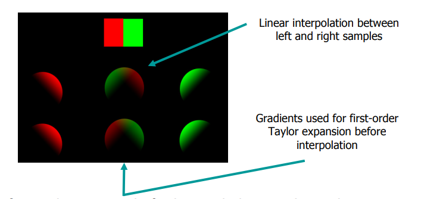

Irradiance Volumes为一种全局光照技术，参考[Irradiance Volumes for Games](https://developer.amd.com/wordpress/media/2012/10/Tatarchuk_Irradiance_Volumes.pdf)，这里记录一下心得体会；
<!--more-->

## 前置理论

首先需要理解光照渲染中常见的radiance、irradiance等物理概念，随后需要了解IBL背后的技术（只理解diffuse部分即可，主要需要知道SH在渲染中的应用）；

首先常见的渲染方程为：

$$
\int_H {L_i(l)BRDF(l,v)V_i(l)cos\theta_l} {\rm d}l
$$

在不考虑投影的情况下，漫反射渲染方程可以写为：

$$
\int_H {L_i(l)\frac{1}{\pi}cos\theta_l} {\rm d}l
$$

整个结果可以认为是函数`$cos\theta_l$`在各个light方向上的卷积；从而可以使用`$L_i$`与`$cos\theta_l$`的球谐系数的乘积来计算`$L_icos\theta_l$`的球谐系数（这里利用了轴对称函数与普通函数的球谐卷积特性，具体可参考[Stupid Spherical Harmonics (SH) Tricks](http://www.ppsloan.org/publications/StupidSH36.pdf)），在乘以球谐基函数，就能重建卷积后各个方向上的diffuse光照；这就是我们常说的球谐光照技术；

当考虑投影时，漫反射渲染方程为：

$$
\int_H {L_i(l)\frac{1}{\pi}V_i(l)cos\theta_l} {\rm d}l
$$

若将`$L_i(l)$`使用球谐系数表示，则漫反射渲染方程为：

$$
L_i(l) = \sum_{i=0}^k l_i B_i(l)
$$

$$
\sum_{i=0}^k l_i \int_H {B_i(l)\frac{1}{\pi}V_i(l)cos\theta_l} {\rm d}l
$$

其中`$\int_H {B_i(l)\frac{1}{\pi}V_i(l)cos\theta_l} {\rm d}l$`这部分是可以针对具体模型的法线方向来进行预计算的，这就是我们常说的PRT技术，具体可参考[GAMES202_Lecture_06.pdf](GAMES202_Lecture_06.pdf)；

## 为什么需要irradiance volumes技术

传统的全局光照一般使用lightmap来表示，带来的问题为存储空间大，只适用于静态场景，只能作用于物体表面；
为了解决这个问题，可以使用irradiance volumes来捕捉静态场景所提供的的整个空间上的光照环境，这样使用irradiance volumes，我们就既可以照射静态物体，也可以照射动态物体，同时不太局限于物体表面，甚至对一些体积产生效果（如雾、云等）；

irradiance volumes的理论其实并不难，只是将IBL的思想扩充到局部场景而已；更多需要解决的问题来自技术应用上；

## irradiance volumes的捕捉

简单的捕捉方法为：在场景中放置对应的irradiance volume，并设置相应的分辨率，随后计算volume中每个探针的光照环境（使用SH表示）；
根据场景的不同，irradiance volume可以使用均匀划分，也可以使用自适应划分;
划分后SH的计算有两种方式，一种是先capture探针的cubemap，随后使用cubemap来计算对应的SH；一种是直接使用tracing的方法来直接计算SH；

## irradiance volumes的rendering

### Sampling the Volume

最简单的方法为，直接采样trilinear后的SH来计算GI，但是对于使用自适应划分的irradiance volume，则需要使用细分面的节点数据来进行trilinear插值；

如果使用均匀划分，则可以使直接使用Tex3D来进行数据的存储，从而使得插值在GPU端进行，并且可以在同一mesh的不同位置来得到不同的gi效果；

使用trlinear有时会带来反向问题，如下图：

文章中使用point+gradient来构建cubic patches的方法来进行插值，从而解决这个问题，具体论文可参考[Spherical Harmonic Gradients for Mid-Range Illumination](https://jankautz.com/publications/gradientSH_RS04.pdf)；

### Self Occlusion

解决self occlusion的方法很简单，直接使用PRT将物体自身的遮挡的SH系数预先计算好，存储至mesh或贴图中即可；随后计算式使用prt来计算自遮挡，irradiance volume来计算光照；

## example

### Direct3D9 SDK

在Direct3D9的SDK中提供了相应的示例，对应的代码在[IrradianceVolume](https://github.com/walbourn/directx-sdk-legacy-samples/tree/main/Direct3D/IrradianceVolume)，使用VS2019即可直接打开时编译运行；

D3D的示例直接在CPU端进行trilinear插值，由于使用了OcTree，SH的存储并不是在Tex3D中，而volume的采样也需要在CPU端进行，并且对于同一个物体只能使用同一个GI来计算；

### Unity

在Unity中，[Light Probe Proxy Volume component](https://docs.unity3d.com/Manual/class-LightProbeProxyVolume.html)组件就提供了uniform volume的使用；从而使得同一个mesh的不同位置能接收到不同的GI；