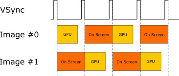
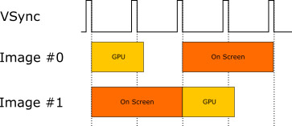
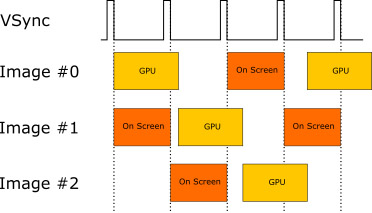

介绍为什么需要triple framebuffer，推荐阅读[What is V-Sync? Should You Turn it on or off?](https://www.hardwaretimes.com/what-is-v-sync-should-you-turn-it-on-or-off/)，以及[Choosing the right number of swapchain images](https://github.com/KhronosGroup/Vulkan-Samples/tree/master/samples/performance/swapchain_images)

<!--more-->

先说结论，single buffer会产生tearing问题；double buffer配合v-sysc可以解决这个问题，但在running rate小于refresh rate时会带来performence问题；

---

假如refresh rate为60fps（即16ms），GPU实际耗时为15ms，那么最终的running rate也为60fps；

---

假如refresh rate为60fps（即16ms），GPU实际耗时为20ms，那么最终的running rate为30fps；具体原因为每隔一帧，GPU虽然完成了渲染，但是已经赶不上16ms的sync，只能赶上33ms的sync，最终的结果就是30fps；

---

引入triple buffer可以解决double buffer带来的performence问题；triple buffer使得GPU渲染结束时可以画到triple buffer上，不必等到sync完成后再绘制；
假如refresh rate为60fps（即16ms），GPU实际耗时为20ms，使用triple buffer，最终的running rate可以达到50fps；
