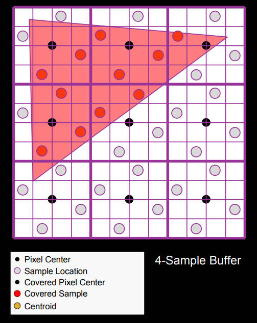
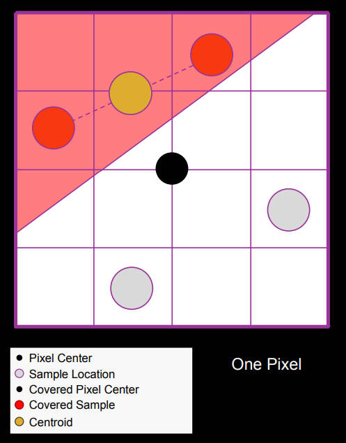
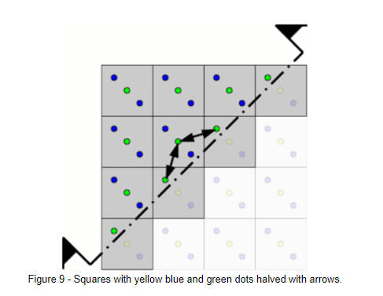

中心插值或质心插值介绍

<!--more-->

## 介绍

正常光栅化流程都是使用像素中心来进行光栅化的插值着色计算；

在msaa中，在同一个像素会使用多采样点来进行是否在图元内的判断，使用像素中心点来进行插值着色计算（center interpolation）；这样就会遇到在同一像素内，有采样点被图元覆盖，但是像素中心点在图元外部的情况；如下图所示：

在这种情况下，使用像素中心点计算得到的属性插值可能会有较大问题，从而使得光照结果出现很大波动；

centroid interpolation就是为了解决这个问题而采用的方案；其采用图元与子像素交集的质心来进行插值计算，实际工程中，会使用图元所覆盖采样点的平均位置来进行插值计算；如下图所示：

使用centroid可以解决插值的问题；但是由于centroid采样位置并不是均匀分布的，从而使得ddx、ddy的计算无法得到数值精确值，进而会引入mipmap计算有误差的问题；如下图所示：

## reference

1. [GLSL: Center or Centroid?  (Or When Shaders Attack!)](https://www.opengl.org/pipeline/article/vol003_6/)
2. [ShadingCourse_HLSL](https://developer.amd.com/wordpress/media/2012/10/ShadingCourse_HLSL.pdf)