本篇文章将针对pbr相关的物理及理论介绍进行深入的学习探讨；

<!--more-->

在之前[unreal的pbr实现](../2022-01-01-real-shading-in-unreal-engine-4.md)介绍中，着重介绍了pbr在应用中的实践，但其实对pbr的物理及理论介绍较少，本篇文章将针对pbr相关的物理及理论介绍进行深入的学习探讨；

## 物理现象

光沿介质传播是光照中最基础的物理现象；介质的变化，导致了光在传播过程，产生了复杂的变化；

光沿介质传播时主要有三种现象：
1. *absorption*，介质不影响光传播的方向，但会吸收传播的能量，针对不同波长，有不同吸收反应；
2. *scattering*，折射率的变化会导致光照方向的变化，如果介质中，存在尺寸与波长相当的微观粒子，由于其折射率的突变，导致光照方向发生变化；此外，如果介质本身的折射率发生了变化（如密度不同引起），那么光的长波方向也会发生变化；
3. *emission*，在介质中，由于其他形式的能量转换为光能，就会有光照的产生，一般发生在光源部位；

> 需要注意的是，*absorption*与*scattering*现象，是与观察尺度有关的；例如，近距离观察物体，空气的影响则可以忽略，如果隔着几公里去观察物体，那么空气的*absorption*与*scattering*现象是必要需要考虑的；

> 光在介质中传播的属性可以用refractive index（折射率，有时也称Index of Refraction，简写IOR）来表示，折射率实际上是一个复数，其实数部分表示介质如何影响光传播速度，虚数部分表示介质对光的能量的吸收，并且折射率与光的波长有关；

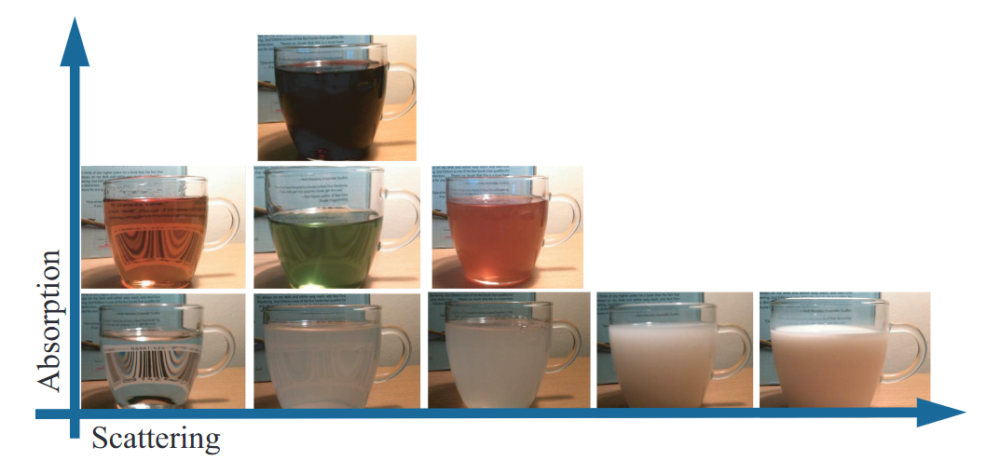

Maxwell方程可以用来计算介质折射率发生变化时的光线传播行为，但是在大多数情况下都是没有解析解的；但是有一特殊情况可以得到解析解，就是当两个介质之间有一完美的平面边界（例如水面），这种情况下有解析解，且该解就是Fresnel方程；

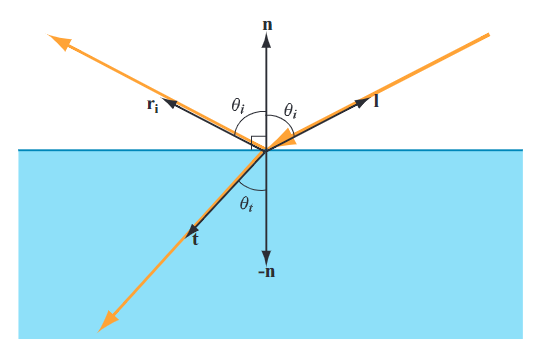

> 这里能够看出，反射的本质仍然是散射，只不过由于介质折射率的突变，散射结果分为了完美反射与完美折射；

但是实际生活中很少有这种完美平面边界的情况，更多的情况是，视觉上或者渲染级别上（pixel or sampling）边界是不规则的，但是相对于光的波长，这些边界仍然可以认为是完美的平面边界；于是在微观上，光的传播仍然可以使用Fresnel来计算，光的反射在微观上仍然是完美反射；

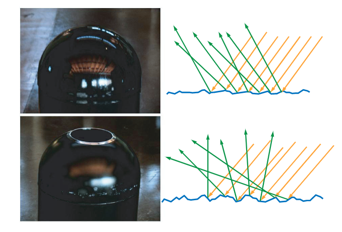

微观上的完美反射，在宏观上，则会呈现出完美反射混合后的结果，即产生一个范围性的反射，同理折射也如此；

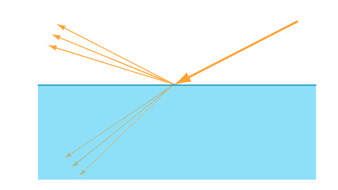

光线折射后的行为根据折射介质的不同，其行为也会有很大的不同；
1. 针对于金属，光在金属内会被理解吸收，从而无法传播，对外就表现出金属对光只有反射效应；

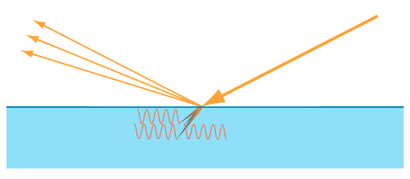

2. 针对于非金属，光在介质内会发生正常的散射与吸收效应；并且部分光经过多次散射后，会沿着介质表面射出（这些散射称之为subsurface scattering）；

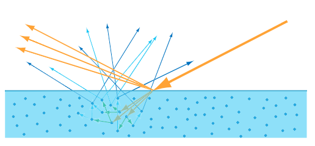

沿着介质界面散射出来的光，根据其出射位置的不同，可以归为两类模型；

- 若沿界面散射出来的发射点，在入射点周围一个像素或者采用范围内，那么我们就可以忽略这些偏移，认为入射点与出射点在同一个位置（即常见的漫反射）；

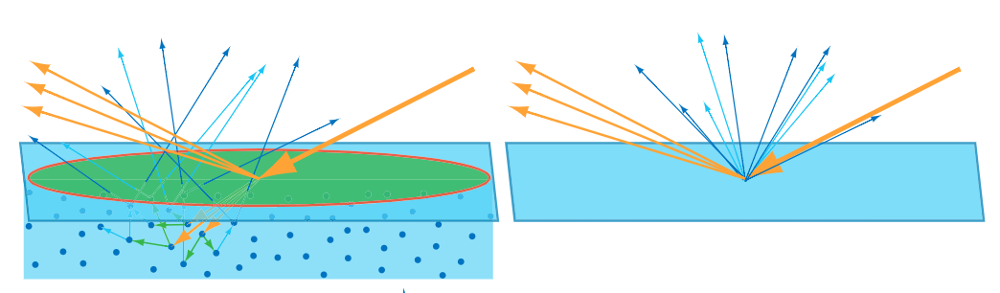

- 若沿界面散射出来的发射点，在入射点周围一个像素外，那么这些偏移就不能够被忽略，必须要在计算时进行考虑（即常见的次表面散射）；

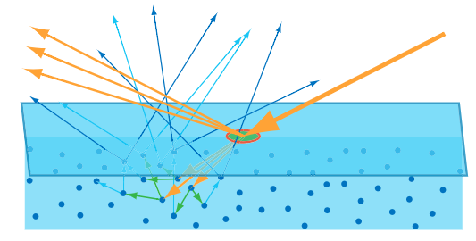

> 根据观察尺度的不同，非金属介质的散射计算模型会发生改变，比如一些入射点与出射点在不同像素位置的散射行为，随着观察距离变远，入射点与出射点会变为在一个像素内；反之亦如此；

## 数学理论描述

这里主要针对surface模型（即IOR发生突变的行为）进行数学描述，并且只针对入射点与出射点在同一位置的情况；

### BRDF

首先使用BRDF来描述入射方向*L*与出射方向*R*确定时的光照反应；

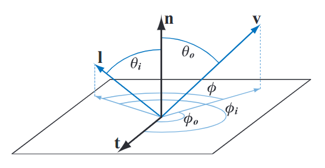

关于BRDF的关键特征如下：

- 入射方向有两个自由度，出射方向有两个自由度，因此BRDF为四自由度函数；
- 针对各项同性介质，在入射方向*L*与出射方向*R*绕中心轴旋转时，BRDF应该是不变的，因此各项同性约束损失一个自由度，BRDF退化为为三自由度函数；
- 相反，针对各项异性介质，在入射方向*L*与出射方向*R*绕中心轴旋转时，BRDF会发生改变，一般使用tangent来指向各项异性介质所偏向的方向；
- BRDF描述的是表面以上反射行为，因此**nol**与**nor**都应该为正值，在实现中由于几何插值或法线贴图计算，会产生负值的情况，因此编码中要使用clamp或者绝对值来进行约束；

在认知上，brdf有两种解释，一种是入射方向固定的情况下，相对入射方向，出射光线的分布情况；另外一种是固定出射方向的情况下，相对出射方向，在各个入射方向上的影响权重分布；

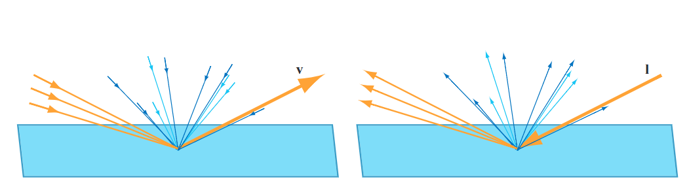

brdf实际上是一个光谱量度，波长应该也在输入输出时进行考虑，从而大大增加了计算维度；不过由于大部分brdf不涉及到跨波长效应（波长的输入与输出并不会产生交叉），因此brdf维度与光的波长维度是一致的，且计算方式与矢量的乘法一致，即brdf(r,g,b)\*light(r,g,b) = (brdf.r\*light.r, brdf.g\*light.g, brdf.b\*light.b)；

BRDF物理上还需要满足两种约束：

1. 可逆性约束，即，当入射方向与出射方向交换时，brdf的值应该是相同的；

$$
f(l, v) = f(v, l)
$$

2. 能量守恒约束，即，出射能量的总和不应该大于入射的能量；

$$
\forall l,  \int _{\Omega}  f(1,v) (n \cdot v) d \omega _{0} \leqslant 1
$$

以上函数实际上有一个专有名词，directional-hemispherical reflectance函数，即*R(l)*；*R(l)*与brdf类似，也不考虑跨波长效应，其值应该位于0-1的范围；针对不同的波长或通道，各个分量也位于0-1范围；

BRDF的建模一般会将前面所描述的反射与散射分开建模，并且将两者分别称之为specular item与diffuse item；

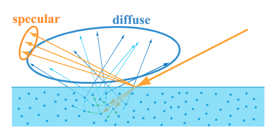

> 实际上，在渲染中会使用到只有diffuse或者只有specular的情况，因此常用的能量守恒条件为：diffuse的*R(l)*位于0-1范围（以Lambert模型为例，需要除以pi来归一化，满足能量守恒），specular的*R(l)*也位于0-1范围，diffuse与specular所占的比例的和同样位于0-1范围；

### Diffuse item

最常见的diffuse模型为Lambert模型，其假设散射部分沿各个出射方向都是均匀的，其brdf如下：

$$
f _{Lambert} (l,v)= \frac {c_{diff}} {\pi}
$$

其中，分子部分为常数值，代表Lambert模型均匀散射特性；分母部分使得Lambert模型的能量守恒，当不考虑`$c_{diff}$`时，*R(l)*的值为1（nol沿半球积分的结果为pi，pi除以pi为1）；

Lambert模型的缺陷也是很明显的，首先，fresnel方程就决定了scattering的量是会随着入射角变化的，那么diffuse brdf的值在掠射角理论上应该小于在法线方向上的diffuse brdf值；

> 修复方法也有多种，一种是简单地乘上（1-Fresnel factor），另外一种是去建立更复杂的diffuse brdf；

另外前面的提到的微表面模型，明显也会对scattering产生影响；[Oren–Nayar Diffuse Model](https://www1.cs.columbia.edu/CAVE/publications/pdfs/Oren_SIGGRAPH94.pdf)除了假设diffuse部分会受到微表面假设的影响（即，受到粗糙度的影响），还假设每个微表面都是一个完美的lambert模型，最终考虑微表面的shadow mask，以及一系列假设下，建立了Oren–Nayar brdf，可以很好的模拟月球表面那种沿着光照方向能反射更多能量的情况，以及很多现实中的材质；

以上两种diffuse改进模型，代表了两种diffuse的优化方向，针对这两种情况，[Material Advances in Call of Duty: WWII](http://advances.realtimerendering.com/s2018/MaterialAdvancesInWWII.pdf)对diffuse的建模做出来进一步的讨论；

> 个人觉得[Material Advances in Call of Duty: WWII](http://advances.realtimerendering.com/s2018/MaterialAdvancesInWWII.pdf)对diffuse的讨论感觉算是目前最好的工程应用；在实践上，其用拟合的方法来满足论文复杂的diffuse模型；最中的结果是，在roughness为1时偏向Oren–Nayar所带来的的flattening，在roughness为0时偏向fresnel方程所带来的rounding；

### Specular item

#### 微表面理论&Specular brdf

Specular brdf完全建立在微表面理论上，整个公式都是基于微表面理论来进行推导的；微表面理论的大体内容为：

- 微表面的尺度小于肉眼可观察尺度（符合视觉认知，其几何假设无法在宏观测到），大于可见光波长尺度（不引入光学复杂性，比如衍射、干涉等）；
- 微表面为理想平滑表面，每个微表面都是绝对平滑的，微表面的法线（简称微法线）决定了该微表面的反射特性；
- 在光线的入射与出射时，微表面假设会引入shadow、mask、interreflection三种响应；这里暂时不考虑interreflection响应；

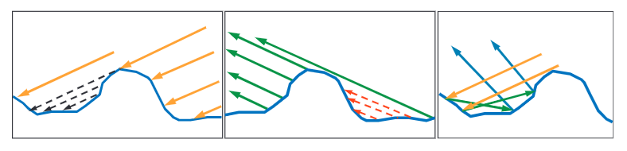

- 当入射方向与出射方向确定时，只有恰好微法线m与半角向量h（l与v的角平分线）一致的微平面才对反射结果有贡献，因此h可认为微表面理论下的真正反射平面的法线；

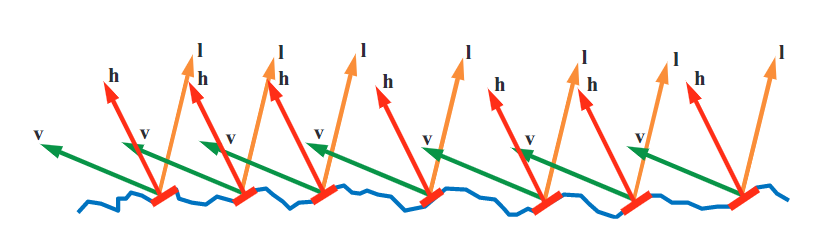

基于以上假设，推导出来的Specular brdf框架为：

$$
f _{ufacet} (l,v) = \frac {F(l,h)G(l,v,h)D(h)} {4(n \cdot l)(n \cdot v)} 
$$

- 其中D项为mcrogeometry normal distribution function (NDF，微表面法线密度分布函数)，表示微法线m在n方向上的分布情况，`$D(h)$`表示在h方向上的概率密度数值；实际上由n与h共同确定，h与n的夹角决定了具体的概率密度数值；很明显，此项还与roughness有关；
- G项由shadow、mask效应产生，`$G(l,v,h)$`表示分别在l方向以及v方向没有被shadow、mask遮住的比例，虽然参数中含有h，但是h可以由l与v求出，与h的关系到不大；另外，l方向以及v方向分别与n的夹角才具体决定了shadow、mask效应；很明显，此项还与roughness有关；
- F项为Fresnel方程，其代表了介质本身特性所带来的的反射效应，即为前面所提maxwell方程在平面反射时的精确解；`$F(l,h)$`表示了从l方向入射，沿h微法线平面所产生反射的结果；实际上l方向以及h方向的夹角才具体决定了Fresnel方程的结果(有些地方用v与h夹角，大小是一样的)；
- 分母`$4(n \cdot l)(n \cdot v)$`为矫正因子，是在推导Specular brdf框架时，radiance在n方向的投影所带来的factor，具体推导可以查看[A Microfacet-based BRDF Generator](https://dl.acm.org/doi/pdf/10.1145/344779.344814);

#### Fresnel item

fresnel方程是maxwell方程的在平面反射时的精确解；其值只与入射角、介质的折射率有关；同时由于折射率会随着波长产生变化，因此Fresnel item也是一个光谱量度（一般由rgb组成）；同时由于其代表反射所占能量的比例，因此其值范围为0-1；

Fresnel方程是及其复杂的，其所使用的材质参数（光谱上的复数折射率）对艺术家也非常不友好，因此在工程上会使用方程的简化版就显得很有必要；在得到简化版方程之前，先对常见介质的fresnel值进行观察；

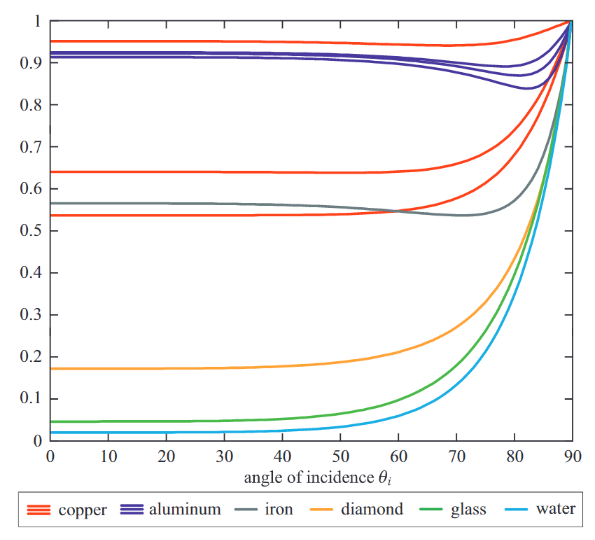

可以看到入射角在0-45°以前，fresnel几乎没有发生变化，在45-90°，fresnel开始从逐步上升到急促上升，然后在90°时，值达到1；

还能看到，针对copper、aluminum，其fresnel值的rgb明明显是不一样的，说明这些材质（金属）对波长的敏感性会更强一些；这也是金属Specular带颜色的原因；另外，金属的fresnel值普遍比非金属要高一些；

由于在入射角为0°时，各材质的差异性最大，因此0°的fresnel常称之为**F0（Specular Color、characteristic specular reflectance）**，使用F0可以更容易来构建fresnel方程简化版；Schlick的文章[An Inexpensive BDRF Model for Physically based Rendering](https://dept-info.labri.u-bordeaux.fr/~schlick/DOC/eur2.html)给出了fresnel函数的简化版：

$$
F_ {Schick} ( F_ {0} ,l,h)= F_ {0} +(1- F_ {0} ) (1-(l\cdot h))^ {5} 
$$

由于微表面模型的假设，h的角度由v与l共同确定，因此在某一视角下的`$l\cdot h$`是不确定的，对应的fresnel值也是不一定的；

常见介质的F0如下表所示；

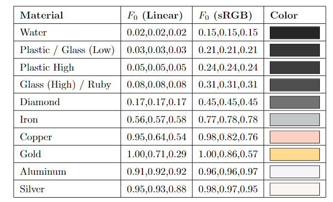

由于常见非金属的F0范围为2%-5%，因此在工程中，经常去0.04来作为非金属的F0；

#### Normal Distribution Function

NDF定义了微表面法线m在几何平面上的统计概率密度分布；基于微表面模型的NDF是有一定约束标准的，具体可参考[understanding_masking_shadowing](https://hal.inria.fr/hal-00942452v1/document)以及[masking_shadowing_slides](https://blog.selfshadow.com/publications/s2014-shading-course/heitz/s2014_pbs_masking_shadowing_slides.pdf)，标准为：

$$
\int( \omega _ {m} \cdot \omega g)D( \omega _ {m} )d \omega _ {m} = 1
$$

这里的积分范围为整个球部方向（以球部法线代替所有微法线可能范围）；公式所代表的含义为，所以角度的微表面在几何平面所投影的面积为单位面积1；D的单位为1/steradians，因此`$( \omega _ {m} \cdot \omega g)D( \omega _ {m} )d \omega _ {m}$`是无量纲的量，具体参考[Microfacet Models for Refraction through Rough Surfaces](http://www.cs.cornell.edu/~srm/publications/EGSR07-btdf.html)

满足归一化条件的NDF有normalized blin phong、ggx、beckmann；blin-phong与beckmann分布比较接近，但是blin-phong是由经验模型演化而来，且其roughness的取值并不位于0-1范围，虽然可以通过其他手段来使其归一化；
ggx与另外两者相比，其lobe更加窄，且可以提供更加长的tail，除了可以应用于反射，还可用于折射计算，另外Desney[pbs_disney_brdf](https://blog.selfshadow.com/publications/s2012-shading-course/burley/s2012_pbs_disney_brdf_notes_v3.pdf)还引入了perceptional roughness来更好体现参数与表现之间的关系；

#### shadow mask function

与NDF一样，基于微表面模型的G函数也是有约束标准的；标准如下：

$$
\int G_ {1} ( \omega _ {o} , \omega _ {m} )( \omega _ {0} \cdot \omega _ {m} ) D( \omega _ {m} )d \omega _ {m} = \cos \theta _ {o}
$$

其代表微表面在o方向的投影面积应该为`$\cos \theta _ {o}$`；实时上除了上述约束标准，还有其他的约束标准需要去遵守；目前只有smith与v-cavity两个函数可以满足标准，且从实际试验数据来看，smith函数更接近真实数据；

## Reference

1. [Background: Physics and Math of Shading](https://blog.selfshadow.com/publications/s2013-shading-course/hoffman/s2013_pbs_physics_math_notes.pdf)
2. [基于物理的渲染（PBR）白皮书](https://zhuanlan.zhihu.com/p/53086060)