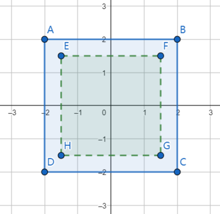
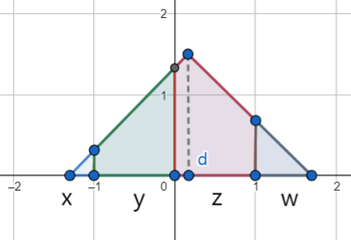
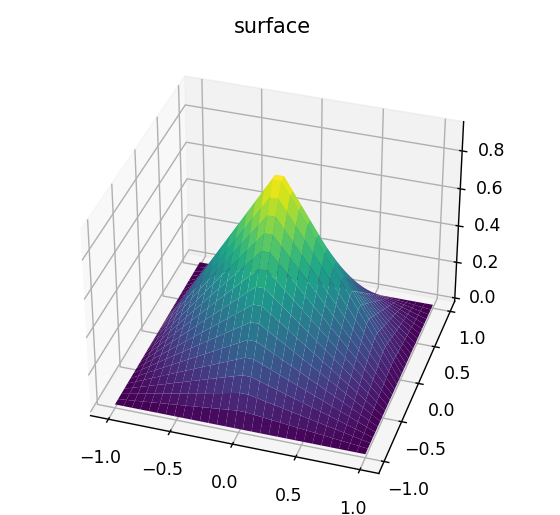
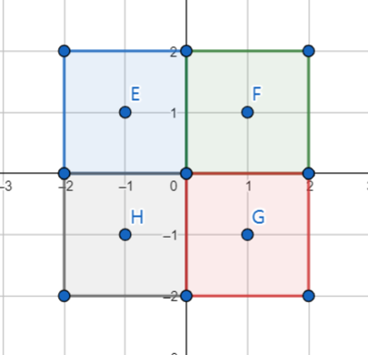

基于unity srp开发csm过程中的心得记录

<!--more-->

总体来说，基于srp来开发csm还是比较方便的；总体的实现思路可以参考urp的实现或者这篇文章[Directional Shadows Cascaded Shadow Maps](https://catlikecoding.com/unity/tutorials/custom-srp/directional-shadows/)；

## 开发过程中的注意点

1. Shadow matrix的计算，这一点，unity有提供对应的api来过去对应的值；但是unity基本是以相机为中心的球形范围来构建各个cascade的view frustum，以及对应的matrix的；相比传统的csm，unity的做法对shadow map的利用率会更低些，不过unity的做法更稳定，matrix计算效率会高些，同时也便于去做不同cascade的优化。另外，在获取project matrix后，需要注意不同平台下reverse-z的处理；

2. Shadow map atalas的使用，使的csm的shadow map只有一张（这种做法没有平台要求）。在实现过程中，只需要设置对应的不同cascade的viewport，view project matrix，让后重新渲染即可。

3. Uniform buffer的管理需要额外去注意，unity srp对shader中使用uniform buffer有了额外的要求，自己去传递参数时要注意做好管理优化；

4. 在利用硬件pcf的情况下，Tent filter的实现远比box filter要复杂；

5. Shadow bias的处理放在shadow caster pass的vs来处理，是一种效率比较高的做法；

6. 不同cascade shadow衔接的处理，有三种处理方法：不处理；采样两个cascade，然后进行插值；使用dither扰动两个cascade之间的边界；

## PCF filter的使用

基于pcf的filter多种多样，如[Poisson Sampling](http://www.opengl-tutorial.org/intermediate-tutorials/tutorial-16-shadow-mapping/)，以及[gpugems](https://developer.nvidia.com/gpugems/gpugems/part-ii-lighting-and-shadows/chapter-11-shadow-map-antialiasing)所提到的uniform filter与对应的优化版本，以及书籍**gpu-pro-360-guide-to-shadows_compress**中所提到的硬件pcf下的uniform filter优化版，以及unity引擎中所集成的硬件pcf下的tent filter优化版；对比下来，硬件pcf下的uniform filter以及tent filter具有更好的性能与表现效果；因此这里着重分析一下unity中硬件pcf下的tent filter的实现方式；

首先3x3的tent filter，可以对应4x4的pixel区域；如下图所示：

tent range

> 示意图来自[geogebra](https://www.geogebra.org/geometry)

单个pixel所对应tent权重，需要根据各像素对应条形面积在三角形总面积的占比来求取；由于当前的阴影计算点，并非一定位于shadowmap像素中心，因此在各像素所对应权重时，需要根据阴影计算点取整后位置的偏移来计算各个像素权重；

triangle area

各像素对应条形面积在三角形总面积的占比，可以分解为两个一维下像素面积占比的计算，相乘后来获取二维下的像素权重；面积的计算可参考[Unity PCF 采样优化算法](https://tajourney.games/5482/)；之所以可以这样做，是因为这个是tent filter本身的特性，在xy各自方向成线性分布，在整体上呈现非线性，[bilinear插值](
https://en.wikipedia.org/wiki/Bilinear_interpolation)也是如此性质；

tent filter

在不利用硬件pcf的情况下，需要采样4x4=16的采样数量，然后使用各个pixel所对应tent权重来求加权和，最终得到tent filter下的结果；在利用硬件pcf的情况下，只需要要采样2x2=4的采样数量，每个采样对应2x2像素采样的bilinear插值；

pcf sample

上图的采样结果并不符合tent filter，如果需要各个采样的加权和和仍然符合tent filter，那么每个采样所对应权重，应该为插值对应的2x2pixel的总权重；同时采样所对应的位置，应该由插值所对应2x2pixel中，各个pixel所对应权重的比值来决定；
