记录基于物理的大气散射背后理论知识及方法，首先是大气散射所基于的体渲染相关理论，然后介绍大气散射相关理论，随后介绍渲染大气散射现象所实际采用的方法；

<!--more-->

## Volume Scattering Theory

体渲染理论包含了一些可穿透介质与光交互时的一些物理现象，这里总结总体参考[PBRT 11.1](https://pbr-book.org/3ed-2018/Volume_Scattering/Volume_Scattering_Processes)以及RTR4 14.1;

### Absorption

描述吸收现象，表示光线穿透介质时，会被介质吸收能量；采用`$\sigma _ a$`来表示，其单位为$m ^ {-1}$；其含义表达式如下：

$$
L_o(p,w) - L_i(p, -w) = dL_o(p,w) = -\sigma_a (p, w) L_i (p, -w) dt
$$

表示光线穿透1m时所被吸收的能量与输入能量的比值，使用时需要对长度积分来计算总体被吸收的能量；

> 注意，这里字母的下标a，代表absorption的意思，下同；

若光线朝w方向移动距离为d，则输出能量与输入能量的比值为：

$$
e^ {-\int _ 0 ^d {\sigma_a (p+tw, w)} dt}
$$

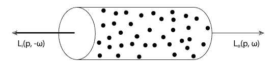

### Emission

描述发光现象，表示光线穿透介质时，所增加的能量（由其他形式转化而来，比如化学能）；直接使用单位下的能量增量`$L_e(p,w)$`来表示，单位大致为 radiance/m；其含义表达式如下：

$$
dL_o(p,w) = L_e (p, w) dt
$$

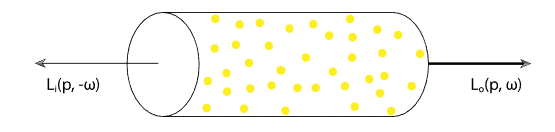

### Out-Scattering

描述外散射现象，表示光线穿透介质时，介质会朝其他方向散射能量，造成能量减少；采用`$\sigma _ s$`来表示，其单位为$m ^ {-1}$，常称之为scattering coefficient；其含义表达式如下：

$$
L_o(p,w) - L_i(p, -w) = dL_o(p,w) = -\sigma_s (p, w) L_i (p, -w) dt
$$

表示光线穿透1m时所被散射的能量与输入能量的比值，使用时需要对长度积分来计算总体被散射的能量；

若光线朝w方向移动距离为d，则输出能量与输入能量的比值为：

$$
e^ {-\int _ 0 ^d {\sigma_s (p+tw, w)} dt}
$$

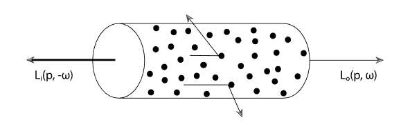

### Attenuation（Absorption + Out-Scattering）

Absorption与Out-Scattering都会产生能量丢失，切能量丢失的表达方式都是一样的，使用光线穿透1m时所减少的能量与输入能量的比值来表示，因此可以使用**attenuation**或**extinction**（能量损失）来方便使用，使用的符号为`$\sigma_t (p, w)= \sigma_a (p, w) + \sigma_s (p, w) $`来表示；其单位为`$m ^ {-1}$`，表示光线穿透1m时所减少的能量与输入能量的比值；

若光线朝w方向移动距离为d，则输出能量与输入能量的比值为：

$$
T_r(p \rightarrow p') = e^ {-\int _ 0 ^d {\sigma_t (p+tw, w)} dt}
$$

该比值常被称之为**transmittance**, 在计算的过程中经常会使用到这个概念；其中的指数部分常被称之为**optical thickness**，一般使用符号`$\tau$`来表示，即：

$$
\tau(p \rightarrow p') = \int _ 0 ^d {\sigma_t (p+tw, w)} dt
$$

$$
T_r(p \rightarrow p') = e^ {-\tau(p \rightarrow p')}
$$

### In-scattering && Phase Functions

Out-Scattering表示光线延当前方向w穿透介质时，会延其他方向散射能量；那么相反，其他方向的光线在延其他方向穿透介质时，也会延当前方向w散射能量；这种现象就叫In-Scattering；

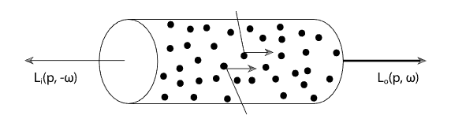

不同方向延当前方向散射的量是不同的，描述介质延不同方向散射量不同的性质使用phase function `$P(w,w')$`来描述；相函数为球形方向的概率密度函数，需满足归一化条件，即：

$$
\int _ {S^2} P(w,w') dw' = 1
$$

且其单位为`$sr^{-1}$`，即角度的倒数，因此使用过程中需要对角度进行积分；相函数本身不涉及散射所带来的能量变化，只描述各方向能量比值关系；

emission与in-scattering现象都会导致能量的增加；若光线朝w方向移动距离为d，emission与in-scattering都考虑的话，所增加的能量为：

$$
dL_o(p,w) = L_s (p, w) dt
$$

$$
L_s (p, w) = L_e (p, w) + \sigma_s (p, w) \int _ {S^2} {P(p,w_i,w)L_i(p,w_i)} dw_i
$$

in-scattering本质上还是由out-scattering所引起的，因此这里实际上为，`$w_i$`方向的`$L_i(p,w_i)$`在当前位置损失的能量`$\sigma_s (p, w)L_i(p,w_i)$`，再乘以当前方向的相函数，即为`$w_i$`方向沿当前方向`$w$`的in-scattering，即 `$\sigma_s (p, w) {P(p,w_i,w)L_i(p,w_i)}$`；之后再沿球面方向进行积分即为上式；

## Atmospheric Scattering

这里关于大气散射理论的总结，主要参考

1. [Volumetric Atmospheric Scattering](https://www.alanzucconi.com/2017/10/10/atmospheric-scattering-1/)
2. [Simulating the Colors of the Sky](https://www.scratchapixel.com/lessons/procedural-generation-virtual-worlds/simulating-sky/simulating-colors-of-the-sky)
3. [基于物理的大气渲染](https://zhuanlan.zhihu.com/p/36498679)

大气散射主要包含两种散射模型，分别是Rayleigh scattering，Mie scattering；

### Atmospheric model

大气模型中，还要一个比较重要的点就是大气密度；密度会导致大气散射行为发生明显的变化，很多大气散射的模型里面都会有密度相关的身影；常用的大气密度模型为指数模型，表达形式为：

$$
density(h)=density(0) e^{-\frac{h}{H}}
$$

其中dansity(0)表示海平面处的密度；H常称之为scale height，意思为海拔变化为H的时候，密度变化为e；

指数衰减实际上是一个比较粗略的假设，在一些论文中会使用更为精确的分层密度模型，如下图所示，以地球为球心会将大气进行分层；每层有不同的密度与厚度数值；

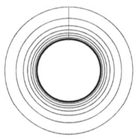

### Rayleigh scattering

Rayleigh scattering主要有空气分子对光线的散射作用，空气分子有很强的波长相关性，其更容易散射短波长的光（blue light），而不容易散射长波长的光（red、green light）；Rayleigh scattering是导致白天天空偏蓝，晚上和造成天空偏红的主要原因；

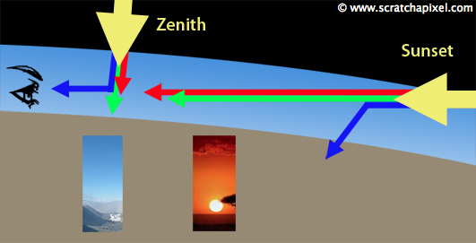

如上图所示，白天光线从地球上方照射，由于路径过短，蓝光更容易被散射，从而进入人眼，导致天空呈现蓝色；早晨或傍晚，光线从地球侧方照射，由于路径过长，蓝光过早被散射消耗掉，只有红光与绿光保留，经过散射后进入人眼，导致天空呈现红色（特别是太阳附近的天空）；

其scattering coefficient为：

$$
\beta_R^s  (h, \lambda) = \frac{8\pi^3(n^2-1)^2}{3N\lambda^4} e^{-\frac{h}{H_R}}
$$

其中，h为海拔；HR为Rayleigh所使用的scale height，常为8km；`$\lambda$`为波长；N为分子密度；n为空气折射率；公式`$e^{-\frac{h}{H_R}}$`表示此模型与密度相关；Rayleigh scattering一般不考虑除了scattering现象之外的其他响应（比如absorption）；由于在计算过程中，分子密度、空气折射率通常按照常数来处理，因此，scattering coefficient也可写为：

$$
\beta_R^s(h,\lambda)=\beta_R^s(0,\lambda) e^{-\frac{h}{H_R}}
$$

其中的`$\beta_R^s(0,\lambda)$`表示海平面处的散射系数，在一些论文的实现中，会将前半部分称之为散射系数，将后半部分称之为散射密度；

其Phase Functions为：

$$
P_R(\mu)=\frac{3}{16\pi}(1+\mu^2)
$$

其中，`$\mu$`为入射方向与出射方向之间的夹角；

### Mie scattering

Mie scattering与Rayleigh scattering的性质比较类似，只是Mie scattering是由空气中的粒子引起的散射，粒子半径远大于波长；Mie scattering是城市中经常看到的灰色雾霾现象的主要原因，太阳周围的halo也是由Mie scattering引起的；

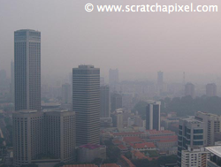

其scattering coefficient为：

$$
\beta_M^s(h,\lambda)=\beta_M^s(0,\lambda) e^{-\frac{h}{H_M}}
$$

其中，h为海拔；HM为Mie所使用的scale height，常为1.2km；`$\lambda$`为波长；其中的`$\beta_M^s(0,\lambda)$`表示海平面出的散射系数，常用`$\beta_S = 210 \mathrm{e^{-5}} \mathrm{m^{-1}}$`来表示；右出的`$e^{-\frac{h}{H_M}}$`表示此模型与大气密度相关；Mie scattering的extinction coefficient一般为1.1倍的scattering coefficient，多出来的0.1由absorption引起；即：

$$
\beta_M^e(h,\lambda)=\beta_M^s(h,\lambda)
$$

其Phase Functions为：

$$
P_M(\mu)=\frac{3}{8\pi}\frac{(1-g^2)(1+\mu^2)}{(2+g^2)(1+g^2-2g\mu)^{\frac{3}{2}}}
$$

其中，`$\mu$`为入射方向与初设方向之间的夹角；g表示该介质的各项异性程度，常用g=0.76来表示；由于Mie是各向异性的，是的Mie scattering具有很强的方向性；这里的相函数跟HG模型比较类似，具体可参考[Phase Functions](https://pbr-book.org/3ed-2018/Volume_Scattering/Phase_Functions)；

### Single scattering

Single scattring描述的并不是某种大气散射现象，而是计算大气散射时所使用的一种假设；如下图所示：

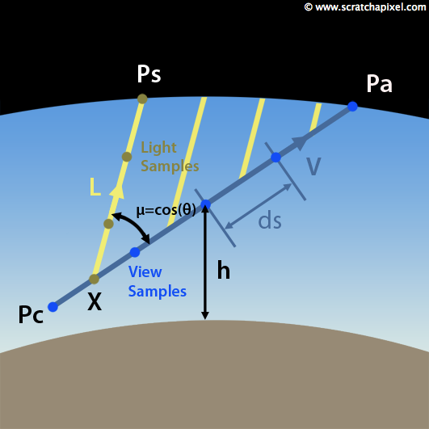

Pc为观察点，Pa为视线与大气边界的交点，X为视线上的采样点，Ps为采样点在光线方向上与大气边界的交点；single scattering所计算的光线路径为眼睛->视线采样点->光线与大气的交点；single scattering所没有计算的情况为为multi scattering，如下图所示：

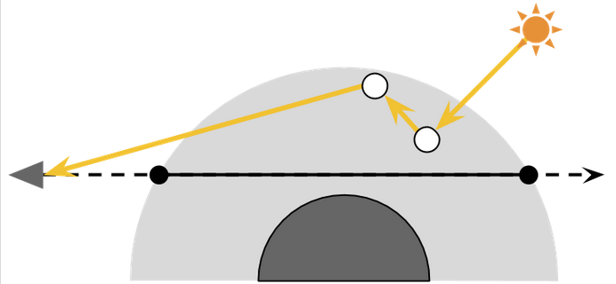

整个single scattering过程需要考虑的现象有：

1. 在Ps至X段，由Rayleigh与Mie引起的out scattering与absorption；
2. 在X至Pc段，由Rayleigh与Mie引起的out scattering与absorption；
3. 在Ps之外的真空，不考虑大气散射现象；
4. 在X点（实际上为ray matching的步进段，应该说是线），光照从L方向散射进V方向的in scattering；
5. 在Pa至Pc段，每一个ray mathing段，都需要考虑来自L方向的光照贡献；

在前面介绍体渲染的时候，有说道transmittance概念，并给出来其积分形式；在使用ray matching的过程中需要使用其微分形式，即：

$$
T(P_a,P_b)=\frac{L_a}{L_b}=exp(-\sum_{P_a}^{P_b} \beta_e(h)ds)
$$

由于Rayleigh与Mie都可以写成从海平面开始衰减的指数形式，因此，transmittance也可改写成：

$$
T(P_a, P_b)=exp(-\beta_e(0) \sum_{P_a}^{P_b} exp(-\frac{h}{H})ds)
$$

从Ps点到X因大气散射，而导致X处的能量为：

$$
SkyColor_L(x)=T(P_a,P_b)*SunIntensity
$$

在X点（ray matching的步进段）考虑in scattering，X点在V方向的能量为：

$$
SkyColor_V(x) = T(P_a,P_b) * SunIntensity * P(V,L) * \beta_S(h) ds
$$

其中`$P(V,L)$`为相函数，`$\beta_S(h)$`为X点的scattering coefficient，`$ds$`为raymatching的长度；

最终X处ray matching段在Pc处的能量为：

$$
SkyColor(P_c) = T(P_c, X) * Sun \: Intensity * P(V,L) * T(X,P_s)*\beta_s(h)ds
$$

考虑到在整个视线上的ray matching段，最终的能量为：

$$
SkyColor(P_c) = \sum_{P_c}^{P_a} T(P_c, X) * Sun \: Intensity * P(V,L) * T(X,P_s)*\beta_s(h)ds
$$

以上就是未优化情况下，最终的积分公式；

其中的`$T(P_c, X) * T(X,P_s)$`由于是指数函数相乘，因此这里可以进行合并，合并后的结果为：

$$
T(P_c, P_s)=exp(-\beta_e(0) \left( \sum_{P_c}^{X} exp(-\frac{h}{H})ds + \sum_{X}^{P_s} exp(-\frac{h}{H})ds \right) )
$$

另外，由于要分别考虑Rayleigh scattering与Mie scattering，但是针对in-scattering与attention，两者的结合方式是不同的，这前面介绍in-scattering与attention所建立的模型有关；直接说结论，针对in-scattering，两种散射的贡献是相加的关系，即

$$
SkyColor(P_c) = SkyColor_R(P_c) + SkyColor_M(P_c) 
$$

针对attention（out-scattering与absorption），两者散射的贡献是相乘的，即

$$
T(P_a,P_b)=T_R(P_a,P_b)*T_M(P_a,P_b)
$$

将上面两式带入前面的积分公式，就能得到考虑Rayleigh scattering与Mie scattering时，应该真正计算的过程；

### Aerial Perspective

如果视线与地面相交，那么上图中Pa点就不在是真空，而是变成了地面的颜色；也就是物体表面的颜色会收到大气散射的影响，这种现象被称之为Aerial Perspective；在渲染中经常使用的Fog就是此现象；如下图所示：

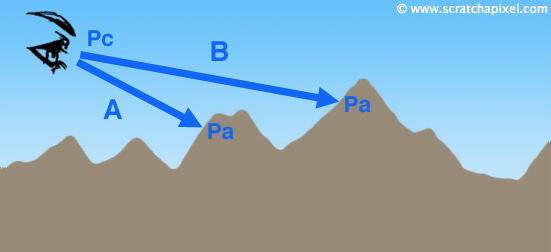

可以看出在Pc至Pa段所要考虑的大气散射现象与前面的Single scattering是一致的，即前面所提到`$SkyColor(P_c)$`;

除此之外，还要考虑大气散射对地面颜色的影响，即空气的out scattering与absorption现象；最终所得到的公式为：

$$
RayColor(P_c) = SkyColor(P_c) + T(P_c, P_a) * ObjectColor
$$

## Rendering Methoad

有了上面的公式就可以直接使用raymatching进行single scattering下的光照积分了，积分代码可参考[Simulating the Colors of the Sky](https://www.scratchapixel.com/lessons/procedural-generation-virtual-worlds/simulating-sky/simulating-colors-of-the-sky);

但是在实际游戏中是很难直接使用积分的算法来达到实时性要求的，因此这里介绍两个改进的算法来更好的将大气散射应用到实际应用中，分别是：

1. [Precomputed Atmospheric Scattering](https://hal.inria.fr/inria-00288758/document)
2. [A Scalable and Production Ready Sky and Atmosphere Rendering Technique](https://sebh.github.io/publications/egsr2020.pdf)

对应的开源代码仓库为：

1. [precomputed_atmospheric_scattering](https://github.com/ebruneton/precomputed_atmospheric_scattering)
2. [UnrealEngineSkyAtmosphere](https://github.com/sebh/UnrealEngineSkyAtmosphere)

### Precomputed Atmospheric Scattering

该算法采用预计算的方式来离线计算所有的光照效果，同时提出基于迭代的算法来计算multi-scattering；

#### trsansmittance lut

在计算single scattering时，要分别计算ray matching步进段到相机的transmittance（v方向）以及ray matching步进段到大气层边缘的transmittance（l方向）；

实际上transmittance是可以预计算为lut，然后实时查找的。在地球是球形的假设下，lut只需要根据当前点高度`$r$`，视线与当前点法线的cos夹角`$\mu$`即可唯一确定，因此使用二维lut即可存储；

#### irradiance lut

对于地面来说其收到的光照也是会收到大气散射影响的，地球上点的irradiance也可以提前进行预计算；在使用lut进行模型光照计算时，模型上点的海拔肯定是会变化的，因此需要进行整个大气层的irradiance的预计算；

在地球的球形假设下，lut只需要根据当前点高度`$r$`，光照方向与当前点法线的cos夹角`$\mu_s$`即可唯一确定，因此使用二维lut即可存储；

#### radiance lut

大气散射的最终结果（在不同点不同方向观察到的天空颜色）存储为radiance lut；同样在球形假设下，radiance结果与当前点高度`$r$`、视线与当前点法线的cos夹角`$\mu$`、光照方向与当前点法线的cos夹角`$\mu_s$`、光照方向与视线的cos夹角`$\mu_v$`有关，是一个四维的lut；

#### multi scattering

对于single scattering，在讲大气散射时已经进行了介绍，那么multi scattering该如何进行计算；

方法与计算GI的方法是一样的，single scattering的结果作为second scattering的输入进行计算；second scattering的输出作为third scattering的输入进行计算；经过几次迭代，就能将结果进行过收敛；

### A Scalable and Production Ready Sky and Atmosphere Rendering Technique

这是unreal所提出的新的lut计算方式，相比上面那种做法，灵活性更高，性能更好，支持实时更新lut；

#### Transmittance LUT

与上一方法一致；

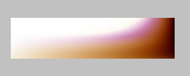

#### Multiple scattering LUT

对multi scattering进行了大量假设，总结如下：

1. 2阶及2阶以上的散射都使用各项同性的项函数；
2. 着色点及附近的所有点光照计算时使用同样量的二阶散射光（这里的附近，针对的是着色点积分所需要的积分点）；
3. 二阶散射光的贡献`$L_{2^{nd}order}$`以及传递函数`$f_{ms}$`（考虑沿介质传递时transimittance的影响）从我们的着色点以及周围所通过的介质来分别计算这两者；
4. 最终的multi scattering`$\Psi_{ms}$`由以上两个参数进行计算，计算二阶散射贡献下的无限阶的散射结果；

所提到的`$L_{2^{nd}order}$`为：

$$
L_{2^{nd}order} = \int _ {4\pi} L'(x_s, -\omega)p_ud\omega
$$

$$
L'(x, v) = T(x,p)L_0(p,v) + \int _ {t=0} ^{||p-x||} \sigma _s(x)T(x,x-tv) S(x_s, -\omega)p_u E_t dt
$$

其中的项函数`$p_u$`为均匀项函数`$1/4\pi$`；

所提到的`$f_{ms}$`为：

$$
f_{ms} = \int _ {4\pi} L_f(x_s, -\omega)p_ud\omega
$$

$$
L_f(x, v) = T(x,p)L_0(p,v) + \int _ {t=0} ^{||p-x||} \sigma _s(x)T(x,x-tv) 1 dt
$$

无限阶下的能量传递函数为：

$$
F_{ms} = 1+f_{ms}+f_{ms}^2+f_{ms}^3+···=\frac{1}{1-f_{ms}}
$$

最终得到的multi scattering为：
$$
\Psi_{ms}=L_{2^{nd}order} F_{ms}
$$

同样在球形假设下，lut只需要根据当前点高度`$r$`，光照方向与当前点法线的cos夹角`$\mu_s$`即可唯一确定，因此使用二维lut即可存储；
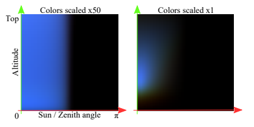
#### Sky-View LUT

以柱状图的方式存储当前视角下的single scattering + multi scattering结果；
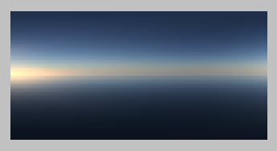
####  Aerial Perspective LUT

针对场景部分，以view aligned volume来存储散射数据，rgb通道用来存储single scattering + multi scattering，a通道用来存储transmittance；
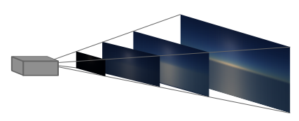