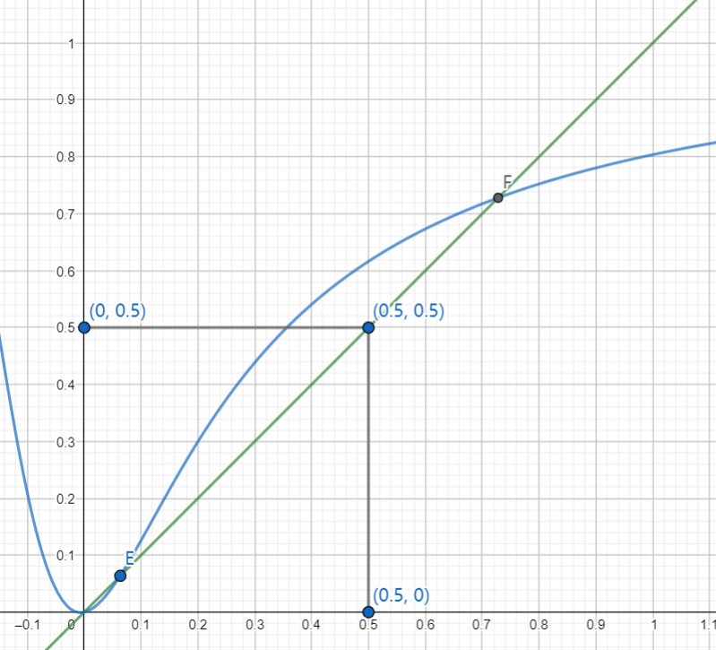
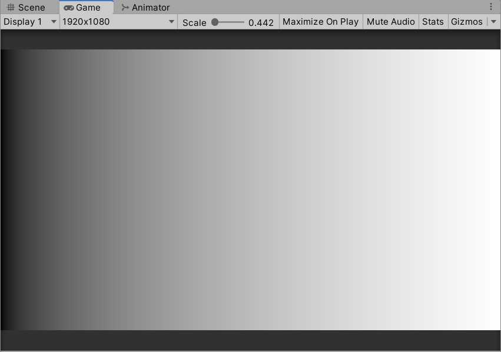
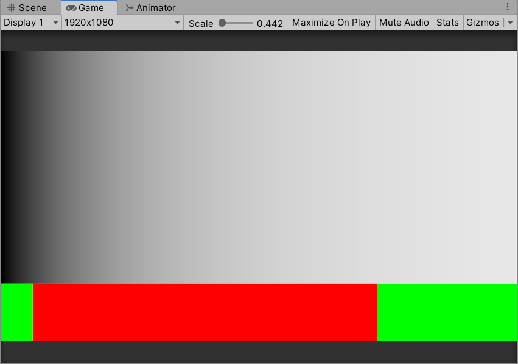
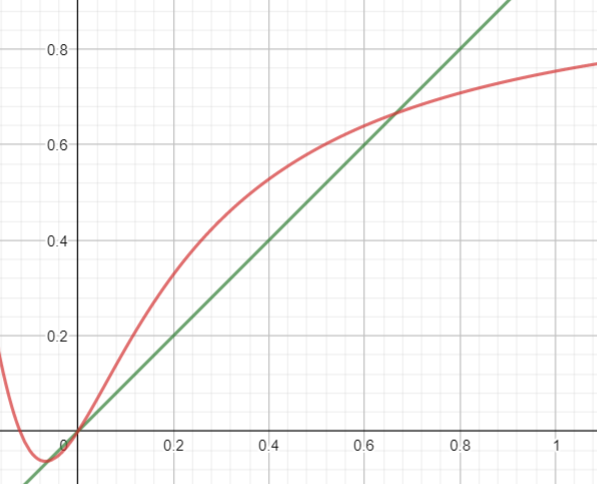
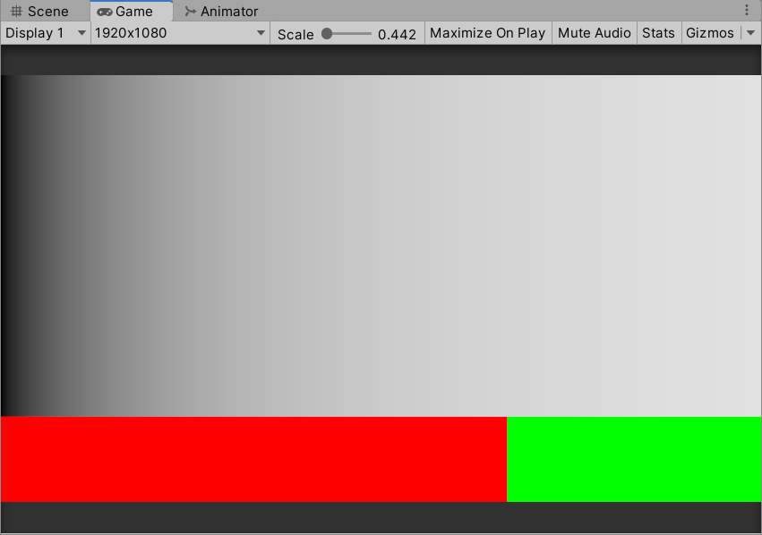
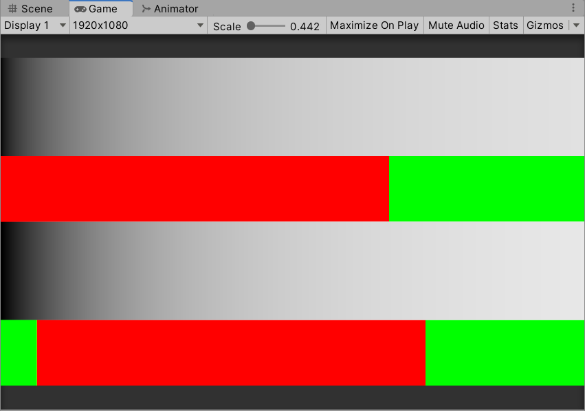
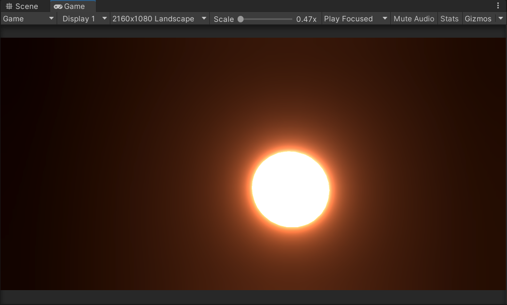
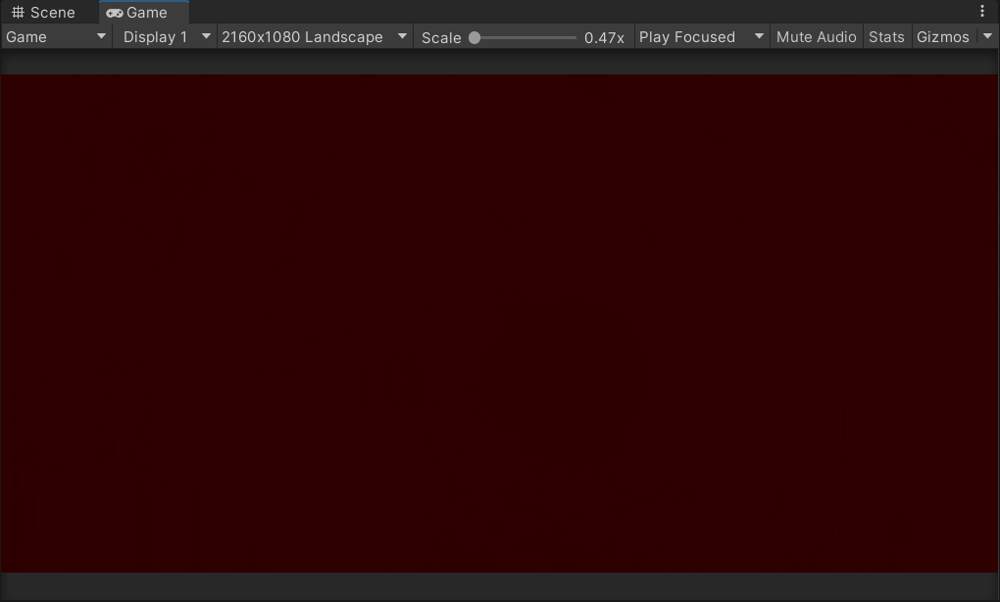
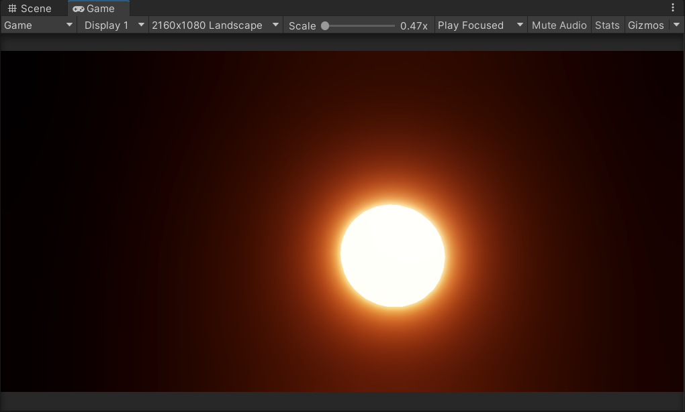
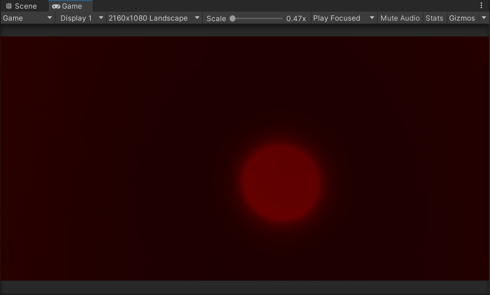

关于tonemapping的一些思考

<!--more-->

## tonemapping曲线

一般认为tonemapping是为了能让颜色从HDR空间更好的映射到LDR空间；主要体现在两个方面：

1. 让暗部变亮；
2. 让亮部变暗；

通过这两种操作来让映射后的画面拥有更多的细节；

但是我们可以观察实际使用的tonemapping曲线来做一些更深入的分析；

aces tonemapping

上图tonemapping曲线使用公式来自[ACES Filmic Tone Mapping Curve](https://knarkowicz.wordpress.com/2016/01/06/aces-filmic-tone-mapping-curve/)，公式为$(x * (2.51 * x + 0.03)) / (x * (2.43 * x + 0.59) + 0.14)$；曲线绘制工具为[geogebra](https://www.geogebra.org/geometry)；蓝色为我们的tonemapping曲线，绿色曲线为$y=x$；

能从曲线分布上看出，点E、F将曲线的功能分为三段；EF段曲线值大于$y=x$，也就是我们常说的暗部提亮过程；F点之后曲线值小于$y=x$，也就是我们常说的亮部压暗过程；

比较奇怪的是E点之前的曲线，这段曲线值小于$y=x$，也就是会将暗部压得更暗；

实际上E点的坐标约为(0.062186,0.062186)，之前对应的区域非常的暗；

下图为tonemapping前0-1颜色

tonemapping后颜色，及曲线上E、F点划分后的区域为：

红色为亮度增加区域，绿色为亮度减小区域；可以看到左侧绿色对应tonemapping区域会更暗，使得画面暗部区域的对比度更强；

我们可以平移曲线，来移除E点之前的区域，平移后曲线公式为$((x + 0.062186)*(2.51*(x + 0.062186) + 0.03))/((x + 0.062186)*(2.43*(x + 0.062186) + 0.59) + 0.14)-0.062186$，得到曲线为

tonemapping后的颜色为:

修改之后tonemapping的暗部区域与修改之前的对比，可以感受到暗部没有那么殷实，对比度没有那么强；

将两者放到一块对比：

实际上E点之前这一部分区域常被称之为Toe，在[unreal](https://docs.unrealengine.com/4.27/en-US/RenderingAndGraphics/PostProcessEffects/ColorGrading/)以及[Hable curve](http://filmicworlds.com/blog/filmic-tonemapping-with-piecewise-power-curves/)都会使用一个单独的参数来控制区域的范围，从而使得暗部区域的对比度有更好的控制；该范围越大，暗部越实，暗部对比度越高；

总结；前面所提的到的暗部提亮过程，实际上只是tonemapping所提供功能的一小部分，不能涵盖tonemapping对暗部的所有控制；在曲线E点之前，tonemapping甚至会压暗本来就比较暗的区域；

## hue shift

[hue shift](https://zhuanlan.zhihu.com/p/356435019)也是tonemapping分常重要的一个特征，能很好的体现高亮度的区域的颜色对比；

下图为经过bloom后，未进行tonemapping的结果：

其对应的hue为：

经过aces tonemapping后的结果为：

其对应的hue为：

可以很明显的看到，对于亮度较高的颜色值，tonemapping后，对应的hue会发生更大的偏移；

当输出设备是hdr设备时，所使用的tonemapping（scene hdr -> screen hdr）会导致hue shift效果丢失，如amd所提供的[LPM](https://github.com/GPUOpen-Effects/FidelityFX-LPM)就不会对hue产生影响；

原神所采用的做法，参考了这篇文章[HDR color grading and display in Frostbite](https://www.ea.com/frostbite/news/high-dynamic-range-color-grading-and-display-in-frostbite)，将调整放在了color grading的shader计算中去了；HDR设备下的输出可参考的案例有unity的[High Dynamic Range (HDR) Output](https://docs.unity.cn/Packages/com.unity.render-pipelines.high-definition@14.0/manual/HDR-Output.html)以及unreal的[High Dynamic Range Display Output](https://docs.unrealengine.com/5.0/en-US/high-dynamic-range-display-output-in-unreal-engine/)

关于tonemapping的更全面介绍，可参考[Tone Mapping](https://www.cl.cam.ac.uk/~rkm38/pdfs/tone_mapping.pdf)(待阅读)