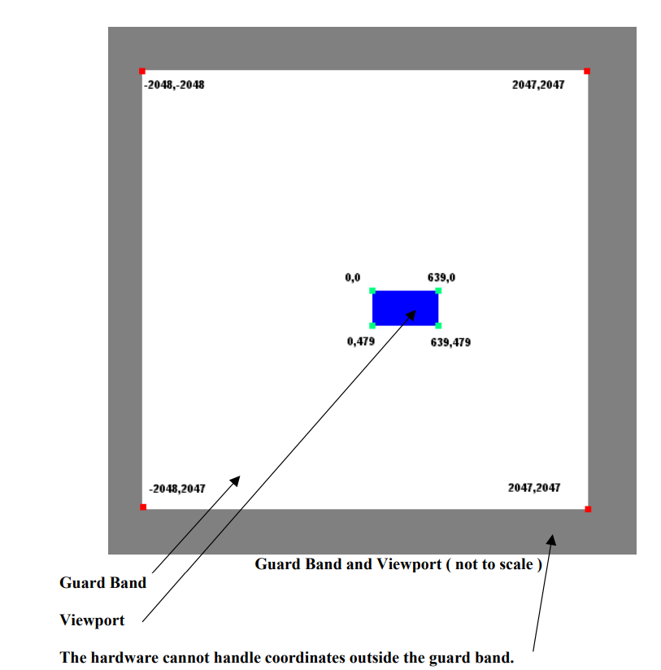
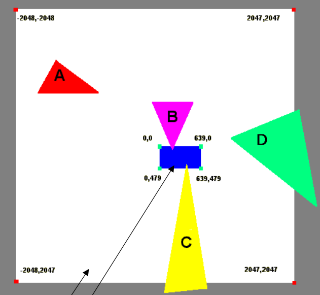

记录gpu graphic pipeline中clipping的处理

<!--more-->

参考资料[Guard Band Clipping in Direct3D](https://developer.download.nvidia.cn/assets/gamedev/docs/Guard_Band_Clipping.pdf)、[RTR4 23.1章节]()；

首先，clipping是在光栅化之前进行的；因为clipping会生成新的三角形，而光栅化的triangle setup阶段需要用到三角形的信息；

clip space下进行视锥体的clipping是一个昂贵的操作，因此GPU不在必要情况下，不会进行clipping，以下是需要进行的clipping的情况：

- near plane会一直进行clipping，cliping后有可能会生成两个三角形；
- 在屏幕的四边上会使用guard-band clipping的clipping方案，用来减少clipping操纵的处理；

## guard-band clipping

首先 guard-band是viewport外一个更大的矩形空间，具体要看硬件，如下图所示；

guard-band外的三角形直接剔除，不需要进行处理；

而其它的三角形与view-port、guard-band的相交情况有以下几种：

**A**：view-port以外，guard-band以内的三角形，可能被cull掉，也可能送到硬件执行后续指令，然后被scissored掉；若送到硬件执行后续指令，会占用额外的bus以及process bandwidth；这种类型不会执行clipping；

**B**：与view-port相交，guard-band以内的三角形，直接送到硬件执行后续指令，然后view-port外的像素会被scissored掉；被scissored掉像素会占用额外的bus以及process bandwidth；这种类型不会执行clipping；

**C**：与view-port相交，同时也与guard-band相交，会执行clipping（可能与view-port进行clip，也可能与guard-band进行）；执行cliping后，在执行后续操作；

**D**：view-port以外，与guard-band相交的三角形，可能直接被cull掉，也可能与guard-band执行clipping，随后送到硬件执行后续指令；

> 这里clipping的方案在nvidia的文章与rtr4中并不一致，若nvidia中的方案是以view-port进行clipping，结果就与rtr4描述一致了；不过nvidia的文章说，有可能会与guard-band进行clipping；