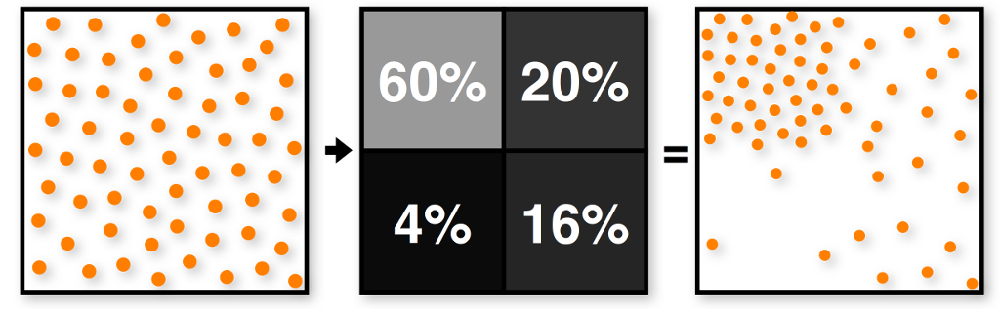

这篇文章主要记录学习[nori](https://github.com/wjakob/nori)完成离线渲染时，所学到的一些坑点以及总结；
<!--more-->

## assignment2: raytracing acceleration data structure

加速结构是光线追踪算法的基础，对于拥有大量三角形的场景，使用加速结构可以显著提升渲染效率；

作业使用了八叉树作为空间加速结构；

单个mesh的八叉树化：八叉树的叶子节点存储该节点所覆盖的三角形的索引；

多个mesh的八叉树化，需要在叶子节点中存储该节点所覆盖的mesh的索引，以及各个mesh下该节点所覆盖的三角形的索引；（这里是一个比较开放的做法，我为了图方便，在物体不多的情况下，采用将每个物体八叉树化的方法来加速）

### 八叉树的构建流程

```c++
Node *build(bounding box, triangles) {
    if (no triangles)
        return nullptr;

    if (only few triangles)
        return new leaf node with triangles;

    triangle_list list[8];

    for (every triangle) {
        for (int i = 0; i < 8; ++i) {
            if (triangle overlaps sub-node i)
                add to list[i];
        }
    }

    Node *node = new Node();
    for (int i = 0; i < 8; ++i)
        node.child[i] = build(bounding box of sub-node i, list[i]);
    return node;
}
```

### 八叉树的遍历流程

```c++
// 使用栈来完成深度优先的节点遍历
stack nodeStack;
nodeStack.push(root);

bool haveIntersect = false;
while (!nodeStack.empty())
{
    Node *node = nodeStack.top();
    nodeStack.pop();

    float boxNear = 0.0f;
    float boxFar = 0.0f;
    if (node->m_bbox.rayIntersect(ray, boxNear, boxFar))
    {
        // 丢弃被遮挡的节点
        if (boxNear > t && haveIntersect)
            continue;

        // 叶子节点下三角形遍历
        if (node->m_isLeaf)
        {
            for (int i = 0; i < node.faceNum; ++idx)
            {
                mesh->rayIntersect(node->faces[i], t)
            }
        }
        else
        {
            // 存储八个子节点的id，以及对应射线的最近相交长度
            array<pair<int, float>, 8> idSorts;

            // 按照长度从远到近排序
            sort(idSorts.begin(), idSorts.end());

            // 按照之前的排序，使用排序后索引完成从远到近入栈
            for (int i = 0; i < 8; i++)
            {
                int sortId = idSorts[i].first;
                nodeStack.push(node->m_childNodes[sortId]);
            }
        }
    }
}
```

> hack point中提到了使用并行化来加速octree的构建，从而可以实时完成动态场景的八叉树化

## assignment3：MC sampling and AO

### MC sampling

MC sampling中最重要的基础为重要性采样，针对不同的函数采用不用的采样分布；

这里介绍了一维下从均匀分布采样变换到指定函数分布采样的通用方法；即：

1. 先计算当前函数PDF的CDF；
2. 然后再计算其反函数，即$CDF^-1(\xi)$由CDF得到原来的变量x;
3. 然后在0-1范围内进行$\xi$的均匀分布采样；
4. 由反函数计算出X即可为符合PDF的采样；

二维下的采样变换可参考[2D Sampling with Multidimensional Transformations](https://pbr-book.org/3ed-2018/Monte_Carlo_Integration/2D_Sampling_with_Multidimensional_Transformations)

根据以上步骤，需要实现的采样分布有：

1. tent 分布
2. uniform disk 分布
3. uniform sphere 分布
4. uniform hemisphere 分布
5. cosine hemisphere 分布
6. beckmann 分布

> beckmann分布、ggx分布、phong分布的采样变换可以直接参考论文[Microfacet Models for Refraction through Rough Surfaces
](https://www.cs.cornell.edu/~srm/publications/EGSR07-btdf.html)

作业比较好的地方在于，其提供了假设检验功能，来验证我们变换后的采样分布是否与期望的函数分布一致，关于假设检验的介绍可以参考[假设检验（Hypothesis Testing）](https://www.cnblogs.com/huzihu/p/9692828.html)、[第 3 章 假设检验](https://bookdown.org/hezhijian/book/test.html#section-64)

### AO

AO使用亮度为1的环境光照射albedo为1的diffuse物体，得到结果就是我们想要的AO；

计算方法为：

1. 视线与模型相交计算，获取相交点；
2. 在相交点处，沿法线方向，使用cosine hemisphere 分布发射反射光线；
3. 反射光线被模型遮挡则返回结果0，未遮挡则返回结果1；
4. 将所有射线结果处以对应pdf后，取其平均数，即为最终结果；

### Hierarchical Sample Warping

当我们使用IBL来照射场景物体时，需要采样IBL来进行光照计算，可参考[Infinite Area Lights](https://pbr-book.org/3ed-2018/Light_Sources/Infinite_Area_Lights)；

问题在于IBL上的亮度分布是不均匀的，亮度较大的像素会贡献更大的光照结果；因此根据IBL的亮度分布来进行重要性采样，能加快收敛速度，避免噪点的产生；

构建步骤为：

1. input：一张（mxm）的IBL图片，均匀分布的2D采样；
2. 计算IBL整个像素亮度，并进行归一化，得到normalized IBL；
3. 计算normalized IBL的mipmap；
4. 针对最高的mip（2x2px），计算上两个像素亮度和、下两个像素亮度和，以及上下亮度和的比值；
5. 根据上下亮度和比值，来warp当前采样；
6. 分别针对上下两像素的左右两边，继续warp当前采样；
7. 持续以上过程，针对每个像素的下个mip对应的（2x2px）进行warp，直到抵达最低mip；
8. output：得到符合像素亮度分布的采样，并且复杂度为$O(log(m))$




## assignment4：white style ray tracing

### area light sampling

需要注意的是，这里的area light一般指的是diffuse area light，即模型上的一个点，会向半球平面上均匀发射光线，可参考[Area Lights](https://pbr-book.org/3ed-2018/Light_Sources/Area_Lights)；

模型上均匀采样的步骤：

1. 计算模型各个三角形面积，并进行归一化；
2. 使用1D的采样分布，根据离散pdf的采样方法，进行三角形的选取；
3. 使用2D的采样分布，在选取的三角形上进行随机采样；

### Direct Distribution Ray Tracing

这一步主要进行diffuse材质下，直接光照的计算；

需要注意的要点有两个：

1. 光照直接采样面光源进行计算，并不会根据材质的brdf进行采样；
2. 积分仍然是针对相交点进行半球积分，但由于我们是在面光源上进行采样计算，因此需要进行相应的微分变换，从相交点的半球积分转换为面光源上的面积分；对应的变换可参考[Sampling Light Sources](https://pbr-book.org/3ed-2018/Light_Transport_I_Surface_Reflection/Sampling_Light_Sources#SamplingShapes)

### Dielectrics material

这一类的材质包含了绝对反射与折射，其相关的采样理论课参考[SpecularReflectionandTransmission](https://www.pbr-book.org/3ed-2018/Light_Transport_I_Surface_Reflection/Sampling_Reflection_Functions#SpecularReflectionandTransmission)；

采样这类材质时，有两点要注意：

1. 需要根据菲涅尔方程，计算反射所占的比例，然后根据此比例来决定当前射线应该反射还是折射；
2. 需要根据相对折射率，计算反射、以及折射的方向；计算折射方向时，需要考虑入射光线与法线的夹角，判断入射光线实在介质内还是介质外；

### Whitted-style ray tracing

结合以上各种，开始进行white ray tracing；

简单来讲，就是：

1. 对于diffuse材质，仍然只进行direct light的计算；
2. 对于Dielectrics、mirror材质，进行反射或折射的递归；
3. 对于emiter，需要返回emission的值；
4. 使用Russian roulette来进行递归的终止；

### Specialized Light Source Sampling

光源作为计算光照时需要经常采样的部分，好好地设计光源采样策略，可以极大的避免噪声的产生，可以设计一些参数化光源用于处理特殊情况；这里作业提供了集中改进思路用于尝试；

1. 避免不可见光源部分的采样，比如：球形光源的背面，在pbrt书籍中提到了使用锥形内均匀采样来提高球形光源的采样效率；（实际上如果是复杂的面光源，也可以提出光源的背面部分，感觉又牵扯到了渲染中的常见的剔除策略）；
2. 高偏差的采样，由于光源后的采样最终要转换到半球空间下进行积分，对应的变换因子为：

$$
\frac{dot(n_y, v_{y-x})}{||y-x||^2}
$$

考虑到重要性采样的使用，采样时应该考虑：距离平方、光源平面与光线夹角的影响；

3. 采样本身如果是完全随机的话，会出现采样点之间过于聚集或过于分散的情况，这些情况就是噪点产生的根源；比较好的结局办法就是使用低差异序列来避免这种情况；

## Assignment 5: Path Tracing, Microfacet Models, and Multiple Importance Sampling

### Microfacet BRDF

在assignment4中，Direct Distribution Ray Tracing中针对diffuse材质，采样光源来进行光照的计算；而这里将针对microfacet材质，采样相应的brdf进行光照的计算，详情可参考[Sampling Reflection Functions](https://pbr-book.org/3ed-2018/Light_Transport_I_Surface_Reflection/Sampling_Reflection_Functions)；

microfacet材质分为diffuse、specular两部分；采样时的步骤有一下部分：

1. 首先针对diffuse与specular的占比，确定当前采样为diffuse还是specular；
2. 如果是diffuse，则采用cosine hemisphere 分布进行采样；
3. 如果是specular，则针对specular中的**D项与cos vh的乘积**进行vh的采样；
4. 如果vh与入射光线并不同向，需要将vh进行反向，使得vh与入射光线同向；

> 值得注意的是，计算wo的pdf与计算wh的pdf是有区别的，两者之间的变换需要考虑Jacobian矩阵的影响；

### Brute force path tracer

暴力光线追踪是最容易理解、最直观的光线追踪算法，其直接体现了光照传输方程的代码化；其基本过程为：

1. 对于所有材质，无论是diffuse材质，microfacet材质，还是Dielectrics、mirror材质，都针对其brdf分布采样出射光线；
2. 每一次相交，光照结果都为：emission（非光源则为0）+brdf*（下一次递归结果）*cos/pdf；
3. 使用Russian roulette来进行递归的终止；
4. 使用迭代来代替递归，从而加速tracing过程；

### Path tracer with next event estimation

暴力追踪由于不容易命中光源，会导致光照结果产生大量的噪点，解决思路就是主动去采样光源来计算光照；next event estimation将光照进行了分离，将直接光照与间接光照分开进行了计算；直接光照的计算则会主动采样光源；

其过程如下：

1. 每一次相交，会直接采样光源，从而计算当前交点下的直接光照；而间接光照才会采样交点brdf的分布，进行下一次追踪；因此每一次相交的光照结果为：直接光照结果（采样光源计算）+brdf*（下一次递归结果）*cos/pdf；
2. 如果间接光照的射线与光源相交，则不需要添加光源的emission，因为间接光照之外的直接光照已经考虑了光源的影响；
3. 使用Russian roulette来进行递归的终止；
4. 使用迭代来代替递归，从而加速tracing过程；

### Path tracer with Multiple Importance Sampling

next event estimation遇到的问题是，当相交点材质粗糙度偏低，光源面积偏大时，从光源上采样的点不容易落到相交点对应的lobe内，从未产生大量无效采样；

Multiple Importance Sampling会综合考虑brdf采样与光源采样的影响；通过对两者的采样结果进行加权平均，来综合两者所带来的优势，具体可参考[MultipleImportanceSampling](https://pbr-book.org/3ed-2018/Monte_Carlo_Integration/Importance_Sampling#MultipleImportanceSampling)；总体过程如下；

1. 每一次相交，会直接采样光源，从而计算当前交点下的直接光照，此外还会根据pdf_light、pdf_brdf计算采样光源的权制；而间接光照才会采样交点brdf的分布，进行下一次追踪；因此每一次相交的光照结果为：直接光照结果（采样光源计算）+brdf*（下一次递归结果）*cos/pdf；
2. 如果间接光照的射线与光源相交，则需要根据pdf_light、pdf_brdf计算采样brdf的权制；
3. 使用Russian roulette来进行递归的终止；
4. 使用迭代来代替递归，从而加速tracing过程；

> 这里有两种特殊的情况需要特别注意：
>
> 1. 对于Dielectrics、mirror材质，不需要使用next event estimation（即采样光源计算直接光照）；因为其brdf分布为delta函数，只有一个有效方向，直接不断tracing即可；
> 2. 对于含有粗糙度的transmission，需要计算的则为btdf；如果对ggx分布计算btdf以及对应的pdf，需要额外的计算公式，具体公式以及推倒可参考[Microfacet Models for Refraction through Rough Surfaces
](https://www.cs.cornell.edu/~srm/publications/EGSR07-btdf.html)。