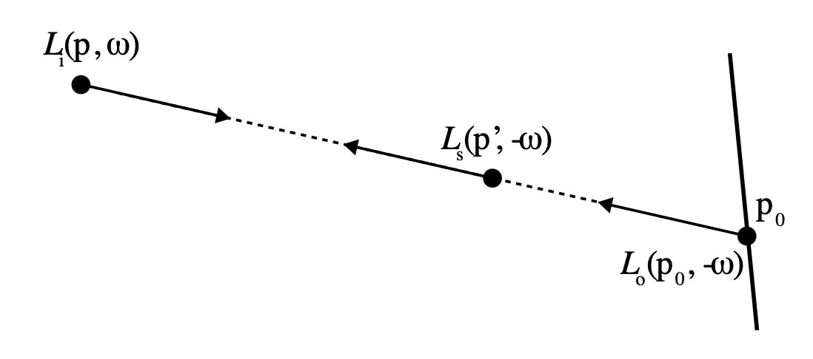
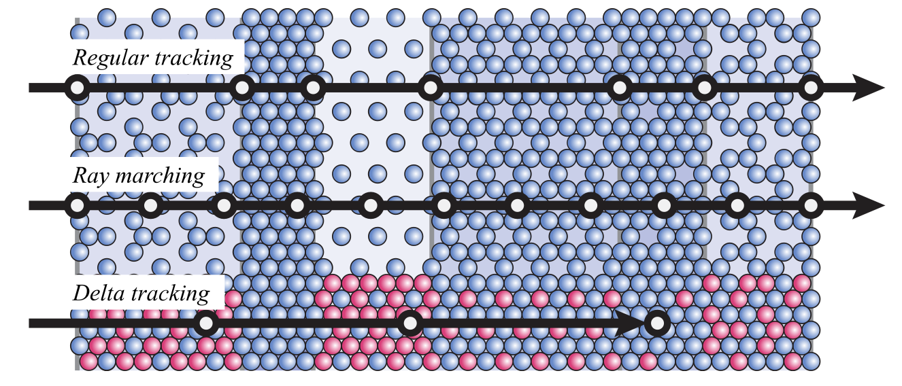

这篇文章主要记录学习离线渲染中体渲染时，所学到的一些坑点以及总结，这里的体渲染暂时不包括次表面散射部分；
<!--more-->

## 前置知识

体渲染理论可参考之前总结大气散射时的[文章](/content/posts/2022-08-12-physically_based_atmosphere_scattering/)以及[pbrt 15.1](https://pbr-book.org/3ed-2018/Light_Transport_II_Volume_Rendering/The_Equation_of_Transfer)，里面介绍了体渲染中基础的in scattering、out scattering、absorption、emission现象；

p点光照来源有自发光，以及内散射：

$$
  L_ {s} (p, \omega )= L_ {e} (p, \omega )+ \sigma _ {s} (p, \omega ) \int _ {_ {S^2}} p(p, \omega ', \omega ) L_ {i} (p, \omega ')d \omega '.
$$

微分上光照损失有外散射，吸收：

$$
  dL_ {o} (p, \omega )= - \sigma _ {t} (p, \omega ) L_ {i} (p, -\omega)dt.
$$

总的微分方程为：

$$
 \frac {\partial}{\partial t} L_ {o} (p', \omega )=- \sigma _ {t} (p', \omega ) L_ {i} (p',- \omega )+ L_ {s} (p', \omega ).
$$

假设光线最终相交于平面上一点p0，最终的积分方程为：

$$
  L_ {i} (p, \omega )= T_ {r} (p_0 \to p)L_{o}(p_0, - \omega )+ \int _0 ^t T_r(p' \to p) L_ {s} (p', -\omega)dt'.
$$

示意图为：



其中Lo表示物体表面p0点沿当前方向的反射结果（这里就需要使用平面反射相关理论进行计算了，不如brdf之类的），最终的体渲染结果就是对上式进行积分；

## 介质表示

主要参考[pbrt 11.3 Media](https://pbr-book.org/3ed-2018/Volume_Scattering/Media#)，要点有以下部分：

1. `Medium`类表示介质的通用功能，比如介质的采样功能等，由子类来定义介质属性冰实现接口；
2. `MediumInterface`类表示介质之间的接口，有两个Medium指针，分别表示内介质、外介质；此类会被模型所引用，模型本身来表示介质的边界，也即实际的interface；
3. `MediumInteraction`表示射线与介质相交时，相交点的一些属性，与平面反射时所用到的`SurfaceInteraction`类似；
4. `HomogeneousMedium`表示均匀介质，介质内所有位置的属性都是统一的，注意均匀并不表示各项同性；其边界可以使用任意的闭合模型表示；
5. `GridDensityMedium`表示网格化介质，介质内存储了离散化的介质属性；其边界应该使用aabb对齐的模型表示；

## 介质采样

前面总结出了最终的积分方程，我们先忽略掉emission项，并假设为均匀介质，则最终的积分方程为：

$$
  L_ {s} (p, \omega )= \sigma _ {s} (p, \omega ) \int _ {_ {S^2}} p(p, \omega ', \omega ) L_ {i} (p, \omega ')d \omega '.
$$

$$
  L_ {i} (p, \omega )= T_ {r} (p_0 \to p)L_{o}(p_0, - \omega )+ \int _0 ^{t_{max}} T_r(p+t\omega \to p) L_ {s} (p+t\omega, -\omega)dt.
$$

要想计算积分方程，需要对光照路径进行采样，除了对路径上的介质进行采样，还需要对路径末端的表面反射进行采样；相关采样理论可参考[pbrt 15.2](https://pbr-book.org/3ed-2018/Light_Transport_II_Volume_Rendering/Sampling_Volume_Scattering)

假设介质内路径的概率密度分布为：

$$
p_t(t)
$$

那么对路径末端的表面进行采样的概率为：

$$
p_{surf} = 1 - \int _0 ^{t_{max}} p_t(t) dt
$$

如果采样到表面，返回的throughout为：

$$
\beta _{surf} = \frac {T_r(p \to p+t\omega)} {p_{surf}}
$$

如果采样到介质，返回的throughout为：

$$
\beta _{med} = \frac {\sigma _ {s} (p+t\omega ) T_r(p \to p+t\omega)} {p_{t}(t)}
$$

到此为止，只需要确定介质路径上的pdf，即可判断采样点；

而采样方向的选择，针对介质直接采样项函数即可，针对物体表面，则变为了普通的平面反射的方向采样；

另外一个需要处理的是 transmission的计算，即公式中Tr的计算；

## 均匀材质

针对均匀材质，由于光照沿路径呈指数衰减的，因此，可以使用指数衰减的pdf，即：

$$
p_t(t) = \sigma _t e^{-\sigma _t t}.
$$

采样到平面的概率为：

$$
p_{surf} = 1 - \int _0 ^{t_{max}} p_t(t) dt = e^{-\sigma_t t_{max}}
$$

对应的均匀采样变换的warp为：

$$
t = - \frac {ln(1-\xi)} {\sigma _t}.
$$

当t大于`$t_{max}$`时，使用平面的采样点；其中的`$\sigma _t$`为介质的衰减系数，由于衰减系数针对不同的颜色通道是不同的，因此可以首先选择一个颜色通道，随后使用改颜色通道的衰减系数进行采样；

而对于均匀材质来说，Tr的计算是比较简单的，直接使用beer定律即可：

$$
T_r = e^{- \sigma _t d}.
$$

## 非均匀介质

针对非均匀介质，其pdf可以采用均匀介质pdf的泛化形式，如下：

$$
p_t(t) = \sigma _t(t) e^{-\int _0 ^t \sigma _t (t') dt'}.
$$

要想求上述pdf，同样需要采样来计算积分；常用的方法有：

1. regular tracking；
2. ray marching；
3. delta tracking；

区别如下图：



离线渲染冲常用的方法还是dalta tracking，具体理论为：

**其假设介质内充满了virtual particle，即上图中的红色粒子，以至于衰减系数在介质内是均匀分布的；这样就可以使用均匀介质中所使用的warp来进行采样的变换，当变换后的采样位于介质内时，就需要根据real particle与virtual particle的比例来决定是否丢弃当前采样（位于virtual，则丢弃）；这种假设的结果刚好满足泛化的pdf分布；**

具体可参考[pbrt 15.2.2](https://pbr-book.org/3ed-2018/Light_Transport_II_Volume_Rendering/Sampling_Volume_Scattering#HeterogeneousMedium)

而Tr的计算刚好与假设的泛化pdf一致，因此Tr的计算可以直接复用以上方法，即：

```c++
Float Tr(ray, sampler) {
    if (Sample(ray, sampler, ...) fails)
        return 1.0;
    else
        return 0.0;
}
```
直接使用以上思路会带来较大消耗，pbrt源码中的` GridDensityMedium::Tr()`则结合了俄罗斯轮盘赌的思路进行了优化，具体参考自论文[Residual ratio tracking for estimating attenuation in participating media](https://cs.dartmouth.edu/wjarosz/publications/novak14residual.html)

## 采样项函数

常用的项函数为HG项函数，可参考[pbrt 11.2](https://pbr-book.org/3ed-2018/Volume_Scattering/Phase_Functions)，即

$$
p_{HG}(cos\theta) = \frac{1}{4\pi} \frac{1-g^2}{(1+g^2+2g(cos\theta))^{3/2}}.
$$

由于项函数是归一化的，因此项函数即为pdf；对应的均匀分布变换的warp为：

$$
\phi = 2\pi\xi.
$$

$$
\cos\theta = -\frac{1}{2g}(1+g^2-(\frac{1-g^2}{1+g-2g\xi})^2)
$$
