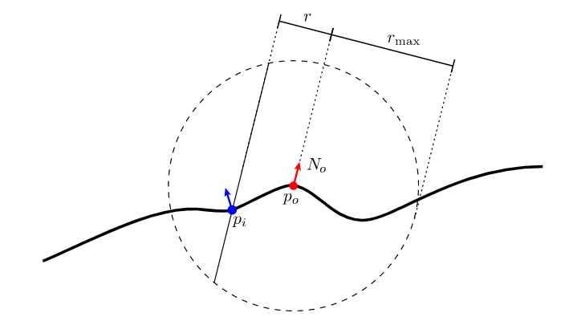
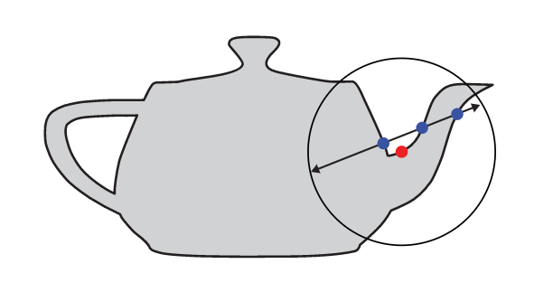

这篇文章主要记录学习离线渲染中渲染此表面散射时，所涉及到的一些理论及方法；
<!--more-->

## BSSRDF

次表面散射在体散射的基础上做了简化，在表面反射的基础上做了扩展，最终得到的散射方程为：

$$
L_o(p_0, \omega _o) = \int _A \int _{H^2(n)} S(p_o, \omega _o, p_i, \omega _i) L_i(p_i, \omega _i) |cos\theta _i| d\omega _i dA
$$

其中**S**表示表面上两点两个方向之间的散射系数，即BSSRDF，最终的散射结果不仅要在半球上进行角度积分，还要在表面上进行平面积分；另外，此表面散射一般假设对应的散射介质都是均匀分布的；对于high-albedo介质，其散射分布一般认为是各项同性的；参考[pbrt 11.4](https://pbr-book.org/3ed-2018/Volume_Scattering/The_BSSRDF)

### Separable BSSRDFs

BSSRDF要在平面或球面上计算任意两点之间的S值是非常困难的，更别说在更复杂的集合模型上，因此一般的BSSRDF采用Separable BSSRDFs模型假设，其公式如下：

$$
S(p_o, \omega _o, p_i, \omega _i) \approx (1-F_r(cos\theta_o))S_p(p_o, p_i)S_\omega(\omega_i)
$$

其中`$(1-F_r(cos\theta_o))$`描述了光线离开散射介质时受到的菲涅尔效应影响，`$S_\omega(\omega_i)$`包含了光线进入散射介质时受到的菲涅尔效应影响，`$S_p(p_o, p_i)$`为profile项，描述了光线在散射介质内传输时，受到的距离影响；

将Separable BSSRDFs模型带入后的散射方程为：

$$
L_o(p_0, \omega _o) = (1-F_r(cos\theta_o)) \int _A S_p(p_o, p_i) \int _{H^2(n)} S_\omega(\omega_i) L_i(p_i, \omega _i) |cos\theta _i| d\omega _i dA(p_i)
$$

我们可假设`$S_\omega(\omega_i)$`为菲涅尔透射的标量项，为：

$$
S_\omega(\omega_i) = \frac{1-F_r(cos\theta_i)}{c\pi}
$$

其中c为归一化因子，其值为：

$$
c=1-2\int _0 ^{\frac{\pi}{2}} F_r(\eta, cos\theta) sin\theta cos\theta d\theta
$$

其中`$\int _0 ^{\frac{\pi}{2}} F_r(\eta, cos\theta) sin\theta cos\theta d\theta$`可称之为一阶fresnel moment，对应的还有高阶fresnel moment，即：

$$
F_{r,i}(\eta) = \int _0 ^{\frac{\pi}{2}} F_r(\eta, cos\theta) sin\theta cos ^i\theta d\theta
$$

其中一阶与二阶的moment经常出现在次表面散射的计算中；在pbrt中，这些项会采用多项式拟合的方式来进行计算；

为了减少模型复杂度带来的profile计算的困难，引入了另外的假设，即：介质表面可假设为局部平面，且其profile值只受两点之间距离的影响，不受两点位置的影响，因此得到的profile模型为：

$$
S_p(p_o, p_i) \approx S_r(||p_o - p_i||)
$$

以上Separable BSSRDFs模型的建立引入了一些假设，这些假设在模型几何复杂的情况下自然也会带来相应的误差；

### Tabulated BSSRDF

最终bssrdf的计算转换为`$S_r(||p_o - p_i||)$`的计算，其计算方法一般采用查表法；

能明显注意到`$S_r(||p_o - p_i||)$`为一维函数，在介质属性固定的情况下；更一般的情况`$S_r$`为介质属性以及距离的函数，介质属性一般包括折射率`$\eta$`，各项异性参数`$g$`，albeda`$\rho$`，衰减系数`$\sigma_t$`，因此最终的函数为`$S_r(\eta, g, \rho, \sigma_t, r)$`

经过一系列的固定与简化，最终转化为只与albedo以及optical redius相关的二维函数，即`$S_r(\rho, r)$`，相应的可以转化为二维表格来进行查询；

profile的计算方式pbrt中提供了两种，一种是使用测量数据来得到，一种是使用[photon beam diffusion（PBD）](https://pbr-book.org/3ed-2018/Light_Transport_II_Volume_Rendering/Subsurface_Scattering_Using_the_Diffusion_Equation#)理论来得到；

### Subsurface Scattering Materials

散射材质`SubsurfaceMaterial`可以使用贴图来控制材质表面的`$\sigma_a$`与`$\sigma_s$`，虽然贴图的变化与bssrdf对材质的假设有些冲突（与bssrdf的可替换性不兼容），但能丰富材质的实际表现；

直接控制`$\sigma_a$`与`$\sigma_s$`是非常不直观的，对艺术家并不友好，因此`KdSubsurfaceMaterial`材质允许用户直接控制diffuse reflectance of the surface以及mean free path`$1/\sigma_t$`，由这两个属性反算出`$\sigma_a$`与`$\sigma_s$`；具体实现可参考[Setting Scattering Properties](https://pbr-book.org/3ed-2018/Light_Transport_II_Volume_Rendering/Subsurface_Scattering_Using_the_Diffusion_Equation#SettingScatteringProperties)，背后的思想相对简单，只是使用BSSRDFTable以及`InvertCatmullRom()`进行反算；

## Sampling Subsurface Reflection Functions

参考[pbrt 15.4](https://pbr-book.org/3ed-2018/Light_Transport_II_Volume_Rendering/Sampling_Subsurface_Reflection_Functions#)，由前面提到的散射方程可以，积分过程需要根据bssrdf决定散射光线的散射位置与散射方向；

### Sampling Separable BSSRDFs

前面提到Separable BSSRDFs的公式为：

$$
S(p_o, \omega _o, p_i, \omega _i) \approx (1-F_r(cos\theta_o))S_p(p_o, p_i)S_\omega(\omega_i)
$$

`$(1-F_r(cos\theta_o))$`可以很方便的根据菲涅尔方程来尽心采样，而`$S_\omega(\omega_i)$`与diffuse的brdf比较类似，因此可以直接使用cos-weighted的方式来采样入射方向；这样只剩下根据`$S_p(p_o, p_i)$`来采样模型表面出射点的位置；

而`$S_p(p_o, p_i)$`为一维函数，因此可以先采样出离出射点的距离(这一步的采样由Tabulated BSSRDF来完成)，然后再以disk随机采样的方式，沿法线透射到模型表面；如下图所示：

若采样点离出射点超过了距离最大距离`$r_{max}$`，直接舍弃即可；

以上方法会遇到三个问题，相应问题及解决方法为：

- profile是与波长相关的；

> 解决方法为：先采样颜色通道，再采样入射点；

- 模型表面是有起伏的，沿法线投射会导致采样点分布不合理；

> 解决方法：沿出射点切线、副切线也进行投射；做法为：先采样投射轴，再进行投射；

- 沿法线投射后，模型上可能不止一个投射点，如下图；

> 解决方法：所有在影响范围内的投射点都需要考虑，随机采样一个点作为入射点；

## Subsurface Scattering Using the Diffusion Equation

前面提到了bssrdf计算最重要的是profile`$S_r(||p_o - p_i||)$`的获取，profile获取后，直接套bssrdf的公式即可；

### Reference

前置参考资料

1. [pbrt 15.15](https://pbr-book.org/3ed-2018/Light_Transport_II_Volume_Rendering/Subsurface_Scattering_Using_the_Diffusion_Equation);
2. [BSSRDF Explorer: A rendering framework for the BSSRDF](https://benedikt-bitterli.me/bachelor-thesis.pdf);
3. [A Practical Model for Subsurface Light Transport](https://graphics.stanford.edu/papers/bssrdf/bssrdf.pdf);
4. [Approximate Reflectance Profiles for Efficient Subsurface Scattering](https://graphics.pixar.com/library/ApproxBSSRDF/paper.pdf);

### Diffusion Theory

次表面散射材质一般都有较高的散射属性，而多次散射的发生会使得光照结果越来越趋向均匀，最终呈现出各向同性的材质属性。该理论称之为自相似理论，是的各项异性材质可以转化为各项同性材质进行建模。该理论为Diffusion理论的假设之一；

另外一个核心假设为：每次散射结果都会模糊输入的光照，从而使得高频的光照信息丢失，在散射性较强的材质内，所有的方向性最终都会丢失；基于此观察，radiance可以展开为前两阶spherical moments的结果，即：

$$
L(x,\vec{\omega}) = \frac {1} {4\pi}\phi(x) + \frac{3}{4\pi} \vec{\omega} \cdot \vec{E}(x)
$$

其中前一项被称之为scale irridance或fluence，即

$$
\phi (x) = \int _{4\pi} L(x, \vec{\omega}) d\omega
$$

后一项被称之为vector irridiance，即
$$
\vec{E} (x) = \int _{4\pi} L(x, \vec{\omega}) \vec{\omega} d\omega
$$

将该项带入光照传输方程，再要所有方向积分，即可得到经典的diffusion 方程（推导过程，建议查看[A Practical Model for Subsurface Light Transport](https://graphics.stanford.edu/papers/bssrdf/bssrdf.pdf);），即：

$$
D\nabla ^2 \phi(x) = \sigma _a \phi(x) - Q_0(x)
$$

其中第二项为一阶内散射结果的角积分，即：

$$
Q_0 (x)= \int _{4\pi} Q(x, \vec{\omega})d\omega
$$

$$
Q(x, \vec{\omega}) = \sigma _s \int _{4\pi} p(\vec{\omega}', \vec{\omega}) L_{ri}(x, \vec{\omega}')d\vec{\omega}'
$$

其中`$L_{ri}$`为一阶散射项，即：

$$
L_{ri}(x_i + s \vec{\omega_i}, \vec{\omega _i}) = e ^{-\sigma _t s} L_{i}(x_i, \vec{\omega _i})
$$

### Monopole Solution

假如介质空间是无限的，介质内存在一个点光源的情况下，diffusion方程是有解析解的，即：

$$
\phi (x) = \frac {\Phi}{4\pi D} \frac {e^{-\sigma_{tr}r(x)}} {r(x)}
$$

其中`$\Phi$`为光源强度，r为据光源距离，`$\sigma_{tr}$`为：

$$
\sigma_{tr} = \sqrt{3 \sigma _a \sigma _t '}
$$

$$
\sigma _t ' = \sigma _s ' + \sigma _a
$$

$$
\sigma _s ' = \sigma _s(1-g)
$$

### 边界条件

对于存在边界的情况，边界条件应为边界上的净通量为0，即：

$$
\int _{2\pi \_} L(x_s, \vec{\omega})(\vec{\omega}\cdot\vec{n}(x_s)) d\omega = 0
$$

若边界内外ior不一致，最终可得到边界条件两项的表达式，即：

$$
\phi(x_s)-2AD(\vec{n}\cdot\vec{\nabla}) \phi(x_s) = 0
$$

由此可得到profile Rd的表达式为：

$$
R_d(r) = -D\frac{\vec{n}\cdot\vec{\nabla}\phi}{d\Phi_i(x_i)}
$$

其中：

$$
r = ||x_s-x_i||
$$

### Dipole Solution

在边界方程已知的情况下，现在的主要问题就是求解边界方程，对于次表面散射，一般使用的边界条件就是无限半平面假设；为了得到精确解，使用的求解模型有多种，这里介绍最基础的dipole solution；

dipole假设存在一对点光源分别位于边界条件的上方与下方，从而构成dipole，对应的解为：

$$
\phi(x) = \frac{\Phi}{4 \pi D}(\frac{e^{-\sigma_{tr}d_r}}{d_r} - \frac{e^{-\sigma_{tr}d_v}}{d_v})
$$

其中：

$$
d_r = ||x-x_r||
$$

$$
d_v = ||x-x_v||
$$

dipole距边界的距离分别为：

$$
z_r = 1/\sigma_t'
$$

$$
z_v = z_R+4AD
$$

最终得到的profile的解为：

$$
R_d(r) = \frac{\alpha'}{4 \pi D}((\sigma_{tr}d_r+1)\frac{e^{-\sigma_{tr}d_r}}{\sigma_t' d_r^3} + z_v(\sigma_{tr}d_v + 1) \frac{e^{-\sigma_{tr}d_v}}{\sigma_t' d_v^3})
$$

需要注意的是此profile只能表示multi scattering部分，还有single scattering部分没有计算（因为在转换为点光源时，已经考虑了一次scattering事件）；类似的方案还有其他dipole的改进模型，以及beam diffusion等；

> pbrt中使用的就是beam diffusion模型，链接为[Photon Beam Diffusion: A Hybrid Monte Carlo Method for Subsurface Scattering](https://graphics.pixar.com/library/PhotonBeamDiffusion/paper.pdf)；
> 值得一提的是，该文章中明确指出了searching light问题中profile的定义，并提出了使用MC的方法来利用多层dipole来计算profile；

> **让人疑惑的是，profile的定义明显考虑了fresnel的影响，而seperable bssrdf在profile外也考虑了fresnel的影响，那么两次fresnel影响不就重复了么？**

> 实际上，还有一部分Reduced Radiance没有考虑，不过一般都会忽略此项，此项可以认为是direct lighting部分，具体可参考[BSSRDF Explorer: A rendering framework for the BSSRDF 2.6.1](https://benedikt-bitterli.me/bachelor-thesis.pdf)

### single scattering

前面提到大部分diffusion解决方案都会丢失single scattering部分，因此single scattering部分需要单独计算；由于不需要考虑multi scattering的影响，single scattering的计算也就相对简单很多；可以直接使用散射方程来进行计算：

$$
L_o^{(1)}(\vec{x_o}, \vec{\omega_o}) = f_t(\vec{x_o}, \vec{\omega_o}) f_t(\vec{x_i}, \vec{\omega_i}) e^{-s_i\sigma_t} e^{-s_o\sigma_t} \alpha p(\vec{\omega_i}\cdot \vec{\omega_o}) L_i(\vec{x_i}, \vec{\omega_i})
$$

在[Photon Beam Diffusion](https://graphics.pixar.com/library/PhotonBeamDiffusion/paper.pdf)文章中提出了single scattering profile的概念，并使用MC的方法来计算对应的profile，pbrt中使用的就是此方法；

### Approximate Reflectance Profiles

前面提到的各种diffusion模型都有其局限性，[Approximate Reflectance Profiles for Efficient Subsurface Scattering](https://graphics.pixar.com/library/ApproxBSSRDF/paper.pdf)文章直接根据大量的profile观察，直接提出了指数拟合的方法，拟合结果非常接近MC，作者称其为**normalized diffusion**；改方法另外一个特点是，将multi scattering，single scattering进行了集成，提供了统一的公式来描述所有材质的profile，使得该方法具有很大的工程友好性；其profile为：

$$
R(r) = As\frac{e^{-sr/l} + e^{-er/(3l)}}{8\pi lr}
$$

$$
s=3.5 + 100(A-0.33)^4
$$

已知的工程应用有**Big Hero 6**，**Unity HDRP**；