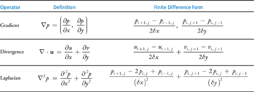

归纳总结在gpu上试下流体模拟，主要总结gpu gems1上的一篇文章，在2d平面上模拟流体实现；

<!--more-->

## 前置理论知识


通常采用笛卡尔坐标系下的速度矢量场来描述流体，并且对流体进行各向同性、不可压缩物理假设，通过求解NS流体运动方程来进行速度场的解算；

### NS方程介绍

流体微元的运动方程仍然遵守牛顿第二定律，即：

$$
F=ma
$$

转换为流体方程则是：

$$
\rho \frac{D \mathbf{u}}{D t} = \rho \left(\frac{\partial \mathbf{u}}{\partial t} + (\mathbf{u} \cdot \nabla) \mathbf{u}\right) = -\nabla p + \mu \nabla^2 \mathbf{u} + \rho \mathbf{f}
$$

该方程称之为NS方程，其中 $\rho$ 即为牛顿公式中的 $m$ ，括号中的和即为流体微元的加速度，等号右边即为流体微元所受的外力；

将该方程写为计算常用形式，即为：

$$
\frac{\partial \mathbf{u}}{\partial t} = - (\mathbf{u} \cdot \nabla) \mathbf{u} -\frac{1}{\rho}\nabla p + \mu \nabla^2 \mathbf{u} + \mathbf{f}
$$

其中左侧即为速度对时间偏导，为流体微元的当地加速度，右侧第一项为对流项，该项描述了空间对速度的影响，该项描述了流体微元延速度进行空间传递的特性，第二项为压力项，对应流体微元的表面压力，第三项为粘性项，对应流体微元的表面剪切力，针对欧拉方程该项为0，第四项为外力项，对应流体微元的体积力，如重力；

同时不可压缩流体虚满足散度为0的条件，即：

$$
\nabla \cdot \mathbf{u} = 0
$$

以上公式中用到的算子符号，其物理含义、展开形式与有限微分形式表示如下：



### 改写NS方程

针对2d下的NS方程，需要求解速度 $\mathbf{u_x}$ 、 $\mathbf{u_y}$ 以及压力 $p$ 三个变量；

直接求解此三项并不是很直观，可以引入Helmholtz-Hodge Decomposition来帮助求解；

Helmholtz-Hodge Decomposition理论证明了一个矢量场可以分解为一个无散场与一个无旋场，切两场相互正交；

刚好流体速度散度为0，压力的梯度的旋度为0，因此可以用一个新的矢量场来表示，如下：

$$
\mathbf{w} = \mathbf{u} + \nabla p
$$

由于流体速度散度为0，对上式应用散度计算可得：

$$
\nabla\mathbf{w} = \nabla^2 p
$$

$\nabla^2 x = b$ 形式的方程称之为泊松方程，很明显上式是一个泊松方程；

将上式中的 $\nabla^2 p$ 采用离散数值替换后，求解 $P$ 就变成了求解一个大型数组，该方程就变成了 $Ax=b$ 的形式，刚好求解该方程可以使用计算方法中的Jacobi迭代法，该方法也便于使用GPU实现。

我们知道矢量是可以分解与投影的，就初中学的向量分解；

对 $\mathbf{w}$ 矢量场应用投影算子，投影至$\mathbf{u}$方向，可得：

$$
\mathbb{P}\mathbf{w} = \mathbb{P}\mathbf{u} + \mathbb{P}\left(\nabla p\right)
$$

根据Helmholtz-Hodge理论， $\mathbb{P}\mathbf{w} = \mathbb{P}\mathbf{u} = \mathbf{u}$ ，因此 $\mathbb{P}\left(\nabla p\right) = 0$ 。

将该投影算子应用到NS方程上，可得

$$
\mathbb{P}\frac{\partial \mathbf{u}}{\partial t} = \mathbb{P}\left(- (\mathbf{u} \cdot \nabla) \mathbf{u} -\frac{1}{\rho}\nabla p + \mu \nabla^2 \mathbf{u} + \mathbf{f}\right)
$$

根据Helmholtz-Hodge理论，可得：

$$
\frac{\partial \mathbf{u}}{\partial t} = \mathbb{P}\left(- (\mathbf{u} \cdot \nabla) \mathbf{u} + \mu \nabla^2 \mathbf{u} + \mathbf{f}\right)
$$

最终上式就是我们最终所要应用的迭代公式，将上式中的对流项、扩散项、外力项分别用符号 $\mathbb{A}$、$\mathbb{D}$、$\mathbb{F}$ 来表示，最终的迭代方程可简写为：

$$
\mathbb{S} = \mathbb{P} \circ \mathbb{F} \circ \mathbb{D} \circ \mathbb{A}
$$

### 迭代过程逐项分析

假如知道了当前时刻的速度矢量场，如何计算 $\delta t$ 时间后的速度矢量场？

#### 对流项

首先计算对流项的影响，其展开形式为：

$$
\frac{\partial \mathbf{u}}{\partial t} = -(\mathbf{u} \cdot \nabla) \mathbf{u} = -\mathbf{u_x}\frac{\partial \mathbf{u}}{\partial x} - \mathbf{u_y}\frac{\partial \mathbf{u}}{\partial y}
$$

将上式中等号右侧移到左侧可得：

$$
\frac{\partial \mathbf{u}}{\partial t} + (\mathbf{u} \cdot \nabla) \mathbf{u} = \frac{D \mathbf{u}}{D t} = 0
$$

此方程即为速度对时间的全导数，即拉格朗日视角下，速度的变化量为0。

因此我们可以切换到拉格朗日时间下来计算，针对每一个流体微元，我们可以根据上一时刻，流动到当前微元的微元的速度来替换，即：

$$
\mathbf{u} \left( \mathbf{x}, t + \delta t \right) = \mathbf{u} \left( \mathbf{x} - \mathbf{u} \left(\mathbf{x}, t\right) \delta t, t\right)
$$

> 这中做法在CFD中称之为半拉格朗日法，实际上针对其他物理量的ns方程，这里速度就可以切换为其他物理量，如密度，温度等。

#### 扩散项

$$
\frac{\partial \mathbf{u}}{\partial t} = \mu \nabla^2 \mathbf{u}
$$

从方程的形式能看出该方程为泊松方程，针对扩散项可以使用显式差分法直接带入进行计算，但为了数值稳定性，使用Jacobi迭代法可能是一个更好的选择，对应公式如下：

$$
x^{(k+1)}_{i,j} = \frac{x^{(k)}_{i-1,j} + x^{(k)}_{i+1,j} + x^{(k)}_{i,j-1} + x^{(k)}_{i,j+1} + \alpha b_{i,j}}{\beta}
$$

这里 $x$ 与 $b$ 都表示速度，$\alpha$ 为`dx * dx / (Viscosity * Timestep)`， $\beta$ 为 $4+\alpha$。

#### 外力项

由于是2维空间上的计算，因此不用考虑体积力；常作为交互输入的外力控制，为了简单计算，可以直接修改流体速度的大小；

#### 投影计算

经过以上步骤会得到一个矢量场，该场其实就是 $\omega$，将该场进行投影后，即可获取最终我们需要的速度场。

如何进行投影，实际上就是将该速度场，减去无旋场，即为我们索要获取的速度场；

而无旋场如何获取，需要先计算 $\omega$ 的散度，随后应用Jacobi迭代法来接泊松公式计算散度对应的压力，再计算压力的梯度即为我们需要的无旋场。

首先求解下式中的压力场：

$$
\nabla\mathbf{w} = \nabla^2 p
$$

使用Jacobi迭代法可得：

$$
x^{(k+1)}_{i,j} = \frac{x^{(k)}_{i-1,j} + x^{(k)}_{i+1,j} + x^{(k)}_{i,j-1} + x^{(k)}_{i,j+1} + \alpha b_{i,j}}{\beta}
$$

这里 $x$ 表示速度， $b$ 表示 $\nabla\mathbf{w}$ ，$\alpha$ 为`-dx * dx`， $\beta$ 为4。迭代以上方程即可求得 $p$。

现在 $\omega$已知， $p$ 已知，代入下式即可得到我们要求的速度场。

$$
\mathbf{u} = \mathbf{w} - \nabla p
$$

### 代码实现过程

有了以上分析，便可得到代码实现过程为：

```c++
u = advect(u);
u = diffuse(u);
u = addForces(u);
// Now apply the projection operator to the result.
p = computePressure(u);
u = subtractPressureGradient(u, p);
```

## Reference

1. [fast fluid dynamics simulation gpu](https://developer.nvidia.com/gpugems/gpugems/part-vi-beyond-triangles/chapter-38-fast-fluid-dynamics-simulation-gpu)
2. [NS推导过程](https://www.sohu.com/a/616386858_115565)
3. [迭代法求解线性方程组](https://mp.weixin.qq.com/s?__biz=MzUxNzE2NjM0MA==&mid=2247484915&idx=1&sn=73f0190c445f7157ddfcfaf4a2a6c731&chksm=f99d0198ceea888ef47567682d8e86679c30ff07eade4e79efc9ba148403f76e967865b1b3d1&token=1966566026&lang=zh_CN#rd)
4. [Jacobi迭代求解二维Possion方程实践](https://mp.weixin.qq.com/s?__biz=MzUxNzE2NjM0MA==&mid=2247484972&idx=1&sn=1285c1115aaecc5497315dd7cf047aa4&chksm=f99d0247ceea8b51c616838b1ebf2228a84d2b758753d3e90cb246eed808a97493bdd3103a93&token=1966566026&lang=zh_CN#rd)