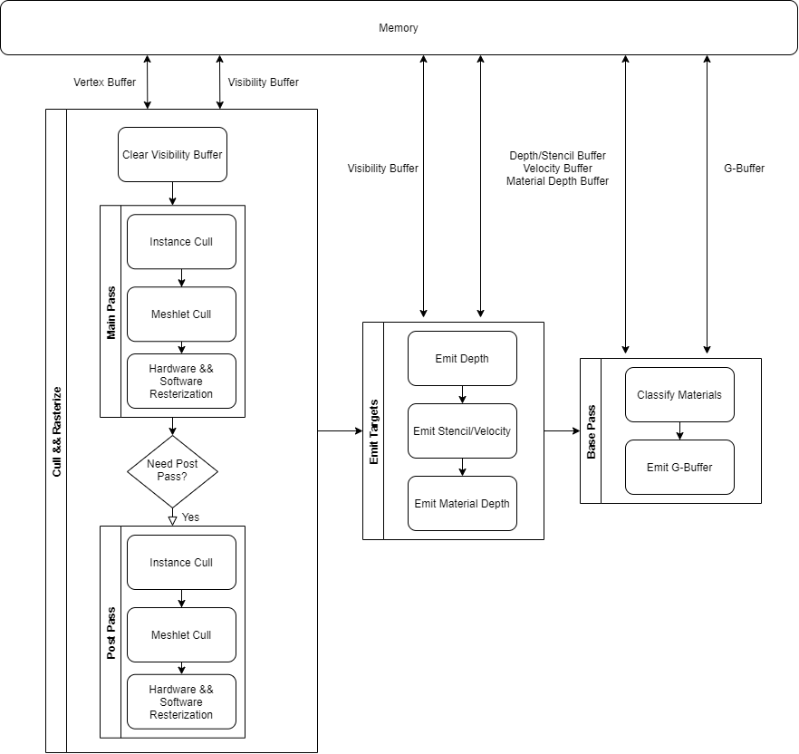

分析UE内部nanite绘制管线实现，需要对nanite有基本的了解；

<!--more-->

## 前置理论知识

Nanite管线的大致理解，可参考[UE5渲染技术简介：Nanite篇](https://zhuanlan.zhihu.com/p/382687738)。简单来说就是，运用GPU Driven Culling + Soft Restarization + Visibility Buffer的混合技术来高效渲染高密度模型，提高大量三角形下的渲染效率。

GPU Driven Culling用来解决三角形overdraw问题，但剔除粒度在instance与meshlet级别；

Soft Restarization用来解决quad overdraw问题，三角形的硬件光栅化会以2x2的quad为基本单位，小于2x2的三角形会造成overdraw，该技术就是为了解决此问题；

Visibility Buffer用来解决带宽与pixel overdraw问题，若没有vbuffer，需要使用gbuffer作为对应rt，使用vbuffer可以减少gbuffer的读写带宽开销，同时vbuffer能省略不可见像素的texture写入gbuffer部分，在减小带宽的同时还能移除pixel overdraw问题；

整体流程为：

## GPU Driven Culling

这部分特殊的地方在于Nanite采用了Two Pass Occlusion Culling的方式来进行instance与meshlet的剔除；具体可参考[理解Nanite（一）：遮挡剔除](https://zhuanlan.zhihu.com/p/583245401)；

剔除主要采用当前视锥体剔除，与上一帧的hzb剔除，包括instance cull与meshlet cull；

在main pass中会将当前instance、meshlet的bound转换到上一帧，然后用上一帧的hzb剔除不可见的instance、meshlet；

剔除过后会使用留下的instance、meshlet进行光栅化获取vbuffer，随后使用vbuffer来构建当前帧的hzb；

在post pass使用当前帧构建的hzb对main pass剔除过的instance、meshlet再进行保守剔除，对未剔除的instance、meshlet再进行光栅化获取最终vbuffer，随后再构建当前帧最终的hzb；

## Reference

