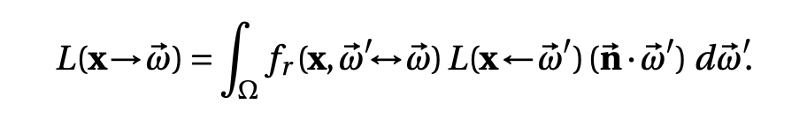
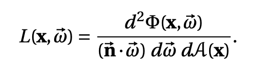
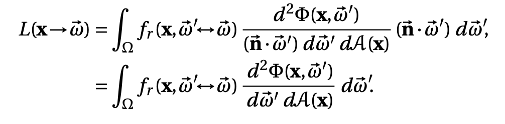
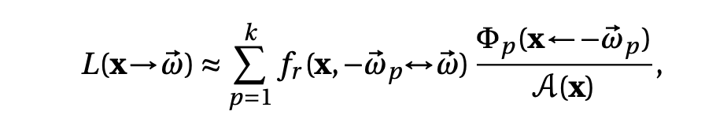

这篇文章主要记录photon mapping算法相关的技术；

<!--more-->

## algothrim overview

参考[The Photon Mapping Method](https://cs.dartmouth.edu/~wjarosz/publications/dissertation/chapter7.pdf)；

pm是一个two pass的算法，第一个pass用来获取场景的photon map，第二个pass使用获取的photon map来计算当前视角下场景的radiance；而photon代表光子，实际上表示的是能量，由光源进行发射，与场景交互后依附在场景表面；每个光子所包含的属性有position、direction、power；

### first pass photon tracing

#### photon emission

在第一个pass，首先由光源来发射光子，每一个光子代表光源的一部分能量；光源发射光子的方法需要根据光源的类型来进行计算，比如：

- 点光源沿球面方向均匀发射；
- 平行光沿均匀平面均匀发射；
- 面光源沿法线方向成cos分布发射；

具体可参考[A Practical Guide to Global Illumination using Photon Mapping](https://www.cs.princeton.edu/courses/archive/fall18/cos526/papers/jensen01.pdf)；

> 面光源沿法线方向成cos分布发射是合理的，因为发射的是能量，对于diffuse area light，其radiance是沿半球方向均匀分布的，而能量需要对投影面积进行积分，从而受到了cos分布的影响；具体可参考书籍Advanced Global Illumination 2.3章节；

#### photon tracing

光子发射后进入场景，会根据相交材质的brdf进行反弹，如果为diffuse材质，则还需要记录到photon map中；在反弹的过程中，光子的能量会受brdf的影响，能量会进行衰减；与正常的path tracing类似，反弹的停止条件也需要使用俄罗斯轮盘赌的方法；

#### photon storing

前面提到与diffuse材质的相交的photon会存储到photon map（即photon的集合），在第二个pass使用photon map渲染时，需要进行半径范围内粒子的查找；因此使用空间加速结构来组织photon map可以更好的加速粒子查找；

### second pass radiance estimation

已知渲染方程为：

而辐射度与通量（能量）之间的关系为：

带入可得：

上式即为计算radiance所最终需要的公式；在实际计算过程中，需要使用计算点半径范围内的photon来进行离散化计算，即

其中`$A(x)=\pi r^2$`；以上就是photon mapping的整个计算过程；

> pm算法最大的优势有两点：一是可以将path tracing计算产生的噪音转化为低频信息，从而减少了噪点的产生；二是pm算法可以更好的处理焦散的问题，当然算法实现上需要额外计算一份焦散的photon map；

## faq

为什么说photon mapping算法是有偏的？

首先，关于有偏的理解可参考[如何理解 (un)biased render](https://www.zhihu.com/question/26683585/answer/33906916)，简单来说，有偏就是期望值不到等于参考值的意思。而pm算法引入有偏的原因，为估算radiance时，需要使用指定半径范围内的photon来进行计算，这个半径就是认为引入bias的来源，从而使得在采样数无限增加的情况下，也无法收敛到参考值。这一点在[CPPM: Chi-squared Progressive Photon Mapping](https://www.bilibili.com/video/BV1DV411n7mB/?vd_source=4d028a6c1255cabb85fd480d6d5e54d8)有使用ppt很好地解释了，半径内与bias的关系；如果半径范围内的photon是均匀分布的，则不会引入bias；