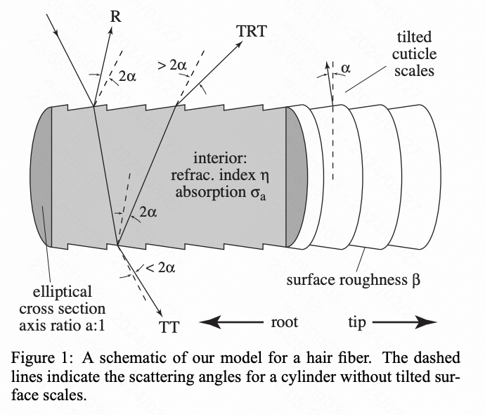
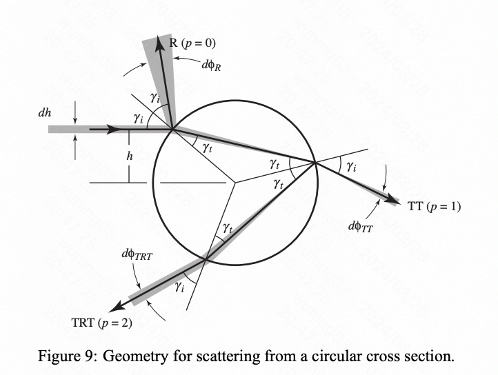
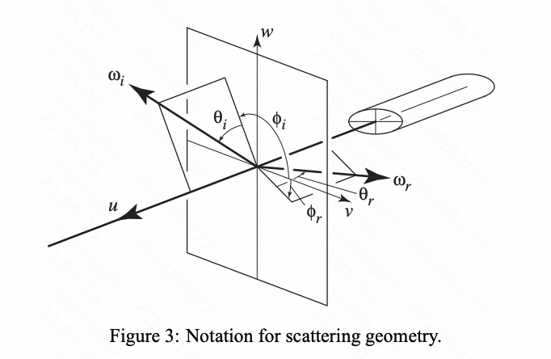
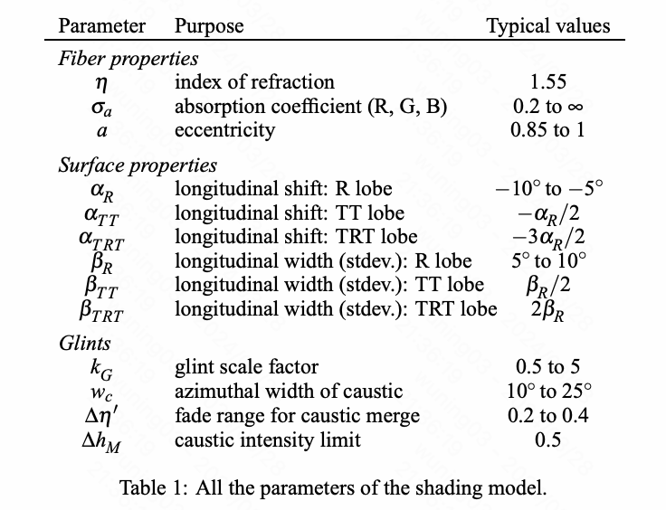

基于物理的头发渲染总结，先介绍基于发丝的且更符合物理的头发渲染理论；随后介绍针对实际光照环境下的single scattering、multi scattering处理；最后介绍UE、Frostbite引擎如何将其接入实际使用当中；

<!--more-->

## 基于发丝的头发着色模型

最经典的发丝假设模型可查看Marschner 2003年的论文[Light Scattering from Human Hair Fibers](http://www.graphics.stanford.edu/papers/hair/hair-sg03final.pdf)，其根据发丝的微观照片以及发丝在光照下的测试数据，在一定假设下给出了计算结果非常吻合测试数据的着色模型；

### 发丝假设

#### 侧截面假设

上图即为着色模型所采用的发丝模型假设；

首先发丝是锯齿状的，并且从发根向发梢，锯齿是朝外倾斜的；倾斜角度为Alpha；

光线第一次与发丝接触，会产生反射R与透射光线；第二次与发丝接触，会产生反射与透射光线TT；第三次接触，会产生反射与透射光线TRT；随后不断会有TRRT、TRRRT等等；

由于发丝的锯齿倾斜，反射与透射的光线也会产生倾斜效果，虚线与实线之间的夹角就是由锯齿倾斜引起的；

#### 横截面假设

当光线与发丝中心轴线不相交时，在横截面上是会产生另外一个纬度的反射与透射，如下图所示：

其中h为光线到中轴线的距离；

R、TT、TRT分别代表前三次反射与透射；

#### 概念约定

u表示从发根指向发梢的tangent向量，i表示入射光线，r表示反射光线；

### Marschner着色方程

首先是针对发丝的渲染方程，不再是针对物体表面的渲染方程；单位是per length，不再是per area；

$$
L_r(\omega_r) = D \int S(\omega_i, \omega_r)L_i(\omega_i)cos\theta_i d\omega_i
$$

其中S即为我们要求的BRDF；考虑到前面所看到的侧面与截面的反射现象，Marschner提出了下面的BRDF模型；

$$
S(\phi_i, \theta_i, \phi_r, \theta_r) = M(\theta_i, \theta_r)N(\eta'(\theta_d), \phi_i, \phi_r) / cos^2\theta_d
$$

其中M即为纵向的影响成分，N为横向的影响成分；

> 由于实在整个球面上进行积分，个人认为这里的S更像是体积分所使用的相函数，针对平行光，Lr=Li\*S，S=M\*N，这也是pbrt以及unreal中实现所体现的计算公式；

M与N计算所使用到的参数如下：

#### Mp的计算

其中M的计算方法如下：

$$
M_R(\theta_h) = g(\beta_R; \theta_h - \alpha_R)
$$
$$
M_TT(\theta_h) = g(\beta_TT; \theta_h - \alpha_TT)
$$
$$
M_TRT(\theta_h) = g(\beta_TRT; \theta_h - \alpha_TRT)
$$

$$
g(\beta,\theta) = \frac {e^{-\theta^2/(2\beta^2)}} {\sqrt{2\pi}\beta}
$$

其中alpha代表反射偏差角度，g代表gaussian函数，beta代表gaussian方差，也可认为是粗糙度；

#### Np的计算

> N的计算方法非常复杂，原论文中也没有给出很明确的计算公式；因此我们在这里跳过

#### Absorption的计算

光线在头发中穿梭，会受到吸收因素的影响；所以N应该为N*Absorption；Absorption的计算如下：

$$
A(0, h) = F(\eta, \gamma_i)
A(p, h) = (1-F(\eta, \gamma_i))^2F(1/\eta, \gamma_t)^{p-1}T(\sigma_a, h)^p
$$

$$
T(\sigma_a, h) = exp(-2\sigma_a(1+cos(2\gamma_t)))
$$

### d’Eon改进着色方程

d’Eon在Marschner的基础上进行了改进，修复了Mp能量不守恒，Np没考虑粗糙度且计算更为方便，参考论文为[An Energy-Conserving Hair Reflectance Model](https://www.researchgate.net/publication/220506677_An_Energy-Conserving_Hair_Reflectance_Model)；

unreal内部实现的ref就是使用的此方法；ref代码与论文中的公式是一致的，直接比对这代码看论文即可；

## Reference

1. [Unreal-Engine-Hair-and-Fur whitepaper](https://epicgames.ent.box.com/s/8lqzuakc8a6dl1r9p6wzoy2h5c61xabv)
2. [Light Scattering from Human Hair Fibers](http://www.graphics.stanford.edu/papers/hair/hair-sg03final.pdf)
3. [Physically Based Hair Shading in Unreal](https://blog.selfshadow.com/publications/s2016-shading-course/karis/s2016_pbs_epic_hair.pdf)
4. [Dual Scattering Approximation for Fast Multiple Scattering in Hair](http://www.cemyuksel.com/research/dualscattering/dualscattering.pdf)
5. [Hair Animation and Rendering in the Nalu Demo](https://developer.nvidia.com/gpugems/gpugems2/part-iii-high-quality-rendering/chapter-23-hair-animation-and-rendering-nalu-demo)
6. [An Energy-Conserving Hair Reflectance Model](https://www.researchgate.net/publication/220506677_An_Energy-Conserving_Hair_Reflectance_Model)
7. [A Fiber Scattering Model with Non-Separable Lobes](https://pdfs.semanticscholar.org/e80f/48ee8139d50709adc87f5802377d24a5c41f.pdf)